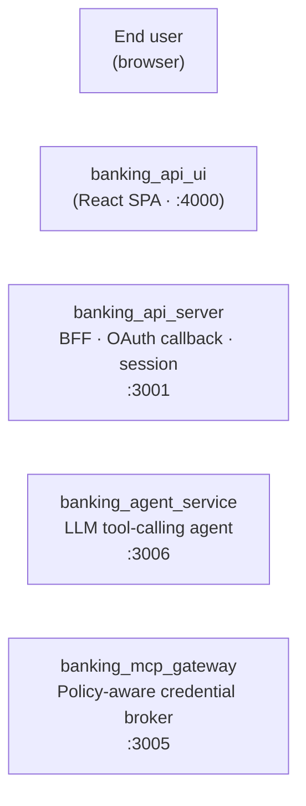

# Phase 270: Architecture diagram completeness audit — Research

**Researched:** 2026-05-14
**Domain:** Architecture documentation, mermaid diagrams, React component audit, test-driven invariants
**Confidence:** HIGH on stack/structure (verified by reading every diagram source + the BFF regen route); MEDIUM on long-term sync-strategy (multiple viable options; pick one in CONTEXT.md)

## Summary

The `/architecture/system` page (rendered by `banking_api_ui/src/components/ArchitectureTabsPanel.jsx`) is genuinely partial. The page exposes **three tabs**:

1. **System Architecture** — renders `InteractiveArchDiagram.js` (an inline React-drawn diagram with **only 5 nodes and 2 arrows**: User, BFF, PingOne, LLM, MCP). It is severely behind the code: no MCP Gateway, no MCP Invest, no Mortgage, no HITL, no Agent Service, no LangChain Agent, no Helix specifically called out, no vault, no Authorize, no banking_resource_server, no SQLite, no K8s topology.
2. **Token Exchange Flow** — renders `TokenExchangeFlowDiagram.jsx` (interactive, drives off `ExchangeModeContext` — 1-exchange ↔ 2-exchange). This is mostly fine but it's a token-flow view, not the system view.
3. **What's Happening** — renders `NarrativePanel.js` (path-aware text walkthrough; Phase 266 R2 paths A/B/C). Also fine; not a diagram.

In addition, an admin-only `DiagramRegeneratePanel` sits above the tabs and can regen four PNG diagrams via SSE (`POST /api/admin/diagrams/regenerate`), rendered by `scripts/build-diagrams.sh` from four `.mmd` sources at the repo root:

| Diagram name | Source (repo root) | Output PNG (banking_api_ui/public/architecture/) | Completeness |
|---|---|---|---|
| overview | `architecture-simple.mmd` | `overview.png` | **Mostly current** — has Gateway, HITL, Authorize, banking_resource_server, SQLite, Paths A/B/C. **Missing:** MCP Invest, Mortgage Service (Phase 266 Path A backend), Agent Service (banking_agent_service :3006), LangChain Agent + 8889/8890 ports, the vault (Phase 269), and the SPA itself (`banking_api_ui` :4000). |
| overview-full | `architecture.mmd` | `overview2.png` | **Very behind** — port labelled :3000, includes "Customer Browser" + admin/customer dual rails, but ports are wrong (CRA dev is :4000, not :3000), no Gateway, no Agent Service, no MCP Invest, no Mortgage, no vault, calls out OpenAI specifically (Helix is the canonical LLM today). Mermaid block contains a stray `BankingRS["…"]` definition AFTER the closing of subgraphs — looks like a half-finished edit. |
| token-flow | `i4ai-ref-arch.mmd` | `token-flow.png` | **Sequence diagram**, not a node graph. Updated for Phase 266 R2. Acceptable as a token-flow view; not a "system completeness" view. |
| mcp-gateway | `mcp-security-gateway.mmd` | `token-flow2.png` | **Conceptually correct for Phase 266 R2** (three paths) but tiny — only 6 nodes. Same omissions as overview: no Agent Service, no MCP Invest, no Mortgage, no LangChain, no SPA, no vault, no PingOne API URLs/JWKS spelled out. |

This phase's job is to (a) bring the diagram source files in line with the **actual SVC_LIST in `run-bank.sh`** (8 Node services + 1 Python service + 4 external systems), (b) draw every edge and OAuth grant the BFF/Gateway/MCP-Server speak today, (c) add Phase 268 (K8s) and Phase 269 (vault) elements as planned future state with a "planned" visual style, and (d) install a regression test that fails when a new service or edge is added without updating the diagram.

**Primary recommendation:** Extend the existing **two** primary mermaid sources in place (`architecture-simple.mmd` for the "clean view" and `architecture.mmd` for the "detailed view"), **don't** create a third "full-system" file — the regen pipeline already handles these two, the React tab already points at them via PNGs (overview.png + overview2.png), and adding a third diagram increases drift risk. Keep mermaid (text-versioned, diffable, the pipeline already exists). Add a single Jest test (`ArchitectureDiagram.completeness.test.jsx`) that reads `run-bank.sh` SVC_LIST and the `.mmd` source files and asserts every service name appears at least once in at least one `.mmd` source. This is **far** lighter than auto-regenerate-on-phase-add and catches the actual failure mode (new service ships, diagram forgotten).

## User Constraints (from CONTEXT.md)

No CONTEXT.md exists at the time of research. The roadmap prompt and orchestrator additional-context provide the constraint frame. The discuss-phase will lock these decisions; current draft answers (from the orchestrator's research-must-answer list) are:

| Decision area | Recommended default (subject to user confirmation) |
|---|---|
| Extend in place vs new "full-system" diagram | **Extend in place** — two diagrams (clean + detailed), update both. |
| Mermaid vs draw.io vs SVG | **Mermaid** — git-diffable, the regen pipeline already exists, scripts/build-diagrams.sh is wired. |
| Sync-going-forward mechanism | **Jest test** that scrapes SVC_LIST from `run-bank.sh` + reads `.mmd` files; fails CI if a SVC_LIST entry isn't named in any `.mmd`. |
| Include Phase 268 (K8s) and Phase 271 (Authorize-everywhere)? | **Yes for 268** (planned K8s topology — dashed/stroke-dasharray "planned" class). **No for 271** (Phase 271 hasn't shipped; its planned arrows would mislead viewers about current state). Add a top-of-diagram note that the diagram represents "current code state". |
| Include Phase 269 vault? | **Yes** — vault is shipped (commit 4b064c89). Show as a startup-load arrow into BFF (`vaultLoader.js` → configStore) and document the planned future arrow into Gateway when REQ-VAULT-08 ships. |

## Project Constraints (from CLAUDE.md)

These directives bind every plan in this phase:

1. **UI build gate.** Any `banking_api_ui/` edit must be followed by `cd banking_api_ui && npm run build` exiting 0. The diagram .mmd sources are at repo root (not under banking_api_ui), but the React component `InteractiveArchDiagram.js` IS under banking_api_ui — if Plan recommends extending that JSX node graph, build gate applies.
2. **Emoji rule.** Only `⚠️`, `✅`, `❌` may appear anywhere. Mermaid sources currently contain emojis (🖥️ in `architecture.mmd`, ☁️ in same file). These must be removed during this phase per REGRESSION_PLAN §0.
3. **REGRESSION_PLAN §1 read-before-edit.** Diagram changes don't touch §1 files directly, but the Jest test in `banking_api_ui/src/components/__tests__/` runs against the existing `ArchitectureTabsPanel.anon.test.js` (a §1-protected component pattern). The new test must not break the existing one.
4. **Minimal diff.** Don't refactor `ArchitectureTabsPanel.jsx` UI — Phase 264 owns the config-page rework, and this phase is explicitly **out of scope for diagram-UI redesign**. Only touch the React component if a node/edge must be added to the inline `InteractiveArchDiagram.js`.
5. **Token custody rule.** Diagrams must NEVER show secret values or render labels that contain credentials. Specifically:
   - Don't label any arrow with the actual `HELIX_API_KEY`, vault password, SOPS key, or any PingOne client_secret.
   - Don't expose internal-only URLs that aren't customer-facing in a way that suggests they're routable from outside (`internal/id-token` is loopback-only; mark it clearly).
   - When showing the vault, the diagram shows the `secrets.vault` filename and the fact that VAULT_PASSWORD is consumed at startup — never the password value or any decrypted key name.
6. **Bug-fix log discipline.** No bug fix is being landed here, so no §4 entry is needed. But the diagram-completeness invariant SHOULD get a new row in REGRESSION_PLAN §1 ("Architecture diagram completeness — every SVC_LIST entry must appear in at least one .mmd source") so future phases know to maintain it.
7. **Default host.** Diagrams must use `api.ping.demo` (not `localhost`) as the canonical hostname. Current `architecture-simple.mmd` shows `:3001` / `:4000` without a host — that's acceptable. `architecture.mmd` shows `port 3000` (wrong) and "auth.pingone.com / {region}" (correct).

## Phase Requirements

No requirement IDs are pre-mapped in `.planning/REQUIREMENTS.md` for Phase 270 — the orchestrator instructs the planner to derive `REQ-DIAGRAM-01..NN`. Suggested mapping (planner can renumber):

| Suggested ID | Description | Research Support |
|---|---|---|
| REQ-DIAGRAM-01 | Every `run-bank.sh` SVC_LIST entry appears as a node in at least one `.mmd` source. | "Service inventory" + sync-test design |
| REQ-DIAGRAM-02 | Every inter-service edge (BFF→Gateway, Gateway→MCP, Gateway→banking_resource_server, MCP→MCP Invest, BFF→Helix, BFF→PingOne AS, BFF→PingOne Management, HITL↔BFF) is drawn. | "Edge inventory" |
| REQ-DIAGRAM-03 | Every OAuth grant (Auth Code+PKCE, Client Credentials, RFC 8693 single-exchange, RFC 8693 2x dual-token, RFC 8693 transaction tokens, CIBA) has a labelled arrow or annotation. | "OAuth grant inventory" |
| REQ-DIAGRAM-04 | External boxes: PingOne (auth + management API), Helix LLM, browser SPA — each present and visually distinguished. | "Edge inventory" external systems |
| REQ-DIAGRAM-05 | Phase 266 paths (A api_key, B dual_token, C oauth_bearer) all drawn with distinct edge styles. | `architecture-simple.mmd` already has this; keep |
| REQ-DIAGRAM-06 | Phase 268 K8s topology elements (cluster boundary, Ingress, public-vs-ClusterIP services) drawn as **planned** (dashed/stroke-dasharray) so viewers understand current vs future. | Roadmap Phase 268 description |
| REQ-DIAGRAM-07 | Phase 269 vault drawn as a startup-load arrow into BFF (current state); Gateway-vault arrow flagged "planned" or omitted. | Phase 269 RESEARCH "Consumer wiring" |
| REQ-DIAGRAM-08 | All emojis removed from `.mmd` sources per REGRESSION_PLAN §0. | "Project Constraints" |
| REQ-DIAGRAM-09 | Jest sync test asserts every SVC_LIST entry appears in at least one `.mmd` source. | "Validation Architecture" |
| REQ-DIAGRAM-10 | Jest sync test asserts a curated edge-and-grant checklist appears as substrings in `.mmd` sources. | "Validation Architecture" |
| REQ-DIAGRAM-11 | Stale ports/hosts fixed: `:3000` → `:4000` in `architecture.mmd`; OpenAI-specific labels replaced with the actual provider chain (Helix-default, OpenAI/Anthropic/Groq/Gemini optional). | `architecture.mmd` audit |
| REQ-DIAGRAM-12 | New REGRESSION_PLAN §1 row: "Architecture diagram completeness". | "Project Constraints" §6 |
| REQ-DIAGRAM-13 | PNGs regenerated via `scripts/build-diagrams.sh` (or via the `/api/admin/diagrams/regenerate` admin route) after `.mmd` edits; verified non-zero file sizes. | `scripts/build-diagrams.sh` |
| REQ-DIAGRAM-14 | `InteractiveArchDiagram.js` inline React node graph either (a) removed from `/architecture/system` first tab and replaced by a static PNG view of overview.png, OR (b) extended in place to add the missing nodes. **Recommend (a)** — there's no upside to maintaining a hand-coded React diagram in parallel with a mermaid source. | `InteractiveArchDiagram.js` audit |
| REQ-DIAGRAM-15 | Token-custody invariant: no secret values rendered in any node or edge label. | "Project Constraints" §5 |

## Standard Stack

### Core

| Library | Version | Purpose | Why Standard |
|---|---|---|---|
| `mermaid` (engine) | 11.15.0 | Diagram-as-text source format; the .mmd files at repo root use mermaid syntax (`flowchart LR`, `sequenceDiagram`, etc.). | The pipeline already uses mermaid via the CLI; mermaid 11.x is the current major. [VERIFIED: `npm view mermaid version` = 11.15.0] |
| `@mermaid-js/mermaid-cli` | 11.15.0 | Renders `.mmd` → `.png` via headless Chromium. Used by `scripts/build-diagrams.sh` with the line `npx -y @mermaid-js/mermaid-cli@10 ...`. The pin to `@10` is now **behind** — bump to `@11` is recommended. | [VERIFIED: `npm view @mermaid-js/mermaid-cli version` = 11.15.0]. Current `scripts/build-diagrams.sh` line 49 pins `@10`. |
| `jest` | 29.7.0 (already installed) | Sync test framework. `banking_api_ui` already uses Jest via CRA. | No new test framework needed. |
| `bash` + `grep` | system | Used by the sync test via `child_process.spawnSync` to grep `SVC_LIST` out of `run-bank.sh`. | Already used by other repo scripts (`scripts/build-diagrams.sh`, `run-bank.sh`). |

### Supporting

| Library | Version | Purpose | When to Use |
|---|---|---|---|
| `fs` / `node:fs` (built-in) | Node 20+ | Read `.mmd` source files in the sync test. | All sync-test file reads. |
| `path` (built-in) | Node 20+ | Resolve repo root from `__dirname` in the sync test. | Sync test only. |

### Alternatives Considered

| Instead of | Could Use | Tradeoff |
|---|---|---|
| Mermaid `.mmd` files | draw.io / `.drawio` (XML) | The repo already has **22 .drawio files in `docs/`** (`token-exchange-flow.drawio`, `BX_Finance_AI_Agent_Tokens.drawio`, etc.). These are **not rendered by the React app** — they're separate manual artifacts. draw.io is great for hand-crafted diagrams but not git-diffable in any useful way; sync test would have to grep XML. **Reject — mermaid is the system of record for the React-rendered diagrams; the .drawio files in docs/ are separate teaching aids.** |
| Mermaid `.mmd` files | hand-rolled SVG | SVG gives pixel-level control but requires a separate authoring tool. We'd lose git-diff readability and the auto-render pipeline. **Reject.** |
| Mermaid `.mmd` files | React-drawn inline diagram (`InteractiveArchDiagram.js`) | Already exists for tab 1. Its weakness: 178 lines of JSX to draw 5 nodes; adding the 13 missing nodes would balloon to ~500 lines and still wouldn't have a regen pipeline. **Reject for primary view; remove if Plan picks REQ-DIAGRAM-14 option (a).** |
| Sync test in `banking_api_ui` | Sync test in `banking_api_server` | Build-diagrams.sh lives at repo root; either side could run the test. Putting it in `banking_api_ui` matches the existing `ArchitectureTabsPanel.anon.test.js` location and keeps "UI-facing artifacts" together. The test reads files at `../../../*.mmd` paths — works from either side. **Pick `banking_api_ui` for proximity to other diagram tests.** |
| Sync test as Jest | Sync test as a pre-commit hook | Pre-commit hooks are bypassable (`--no-verify`) and don't run in CI by default. Jest runs in every test command including `./run-bank.sh test`. **Pick Jest.** |
| Auto-regenerate on phase add (cron / git hook) | Sync test only | Auto-regen is overkill: regen takes 60–90 seconds (downloads Chromium ~150 MB on first run). Sync test catches the failure mode (forgotten edit), regen is a one-shot manual step the planner does once per phase. **Pick sync test only.** |

**Installation:** None — all dependencies already installed.

**Version verification:**
- `mermaid` 11.15.0 — verified 2026-05-14 via `npm view mermaid version`
- `@mermaid-js/mermaid-cli` 11.15.0 — verified 2026-05-14 via `npm view @mermaid-js/mermaid-cli version`. Note: `scripts/build-diagrams.sh:49` pins `@10` (one major behind). Bumping to `@11` is a one-character change and aligns with the current major.
- `jest` 29.7.0 — already in `banking_api_ui/package.json` (CRA-default)

## Architecture Patterns

### Recommended Project Structure

```
.
├── architecture-simple.mmd      # PRIMARY: clean "system overview" — edit this
├── architecture.mmd             # SECONDARY: detailed view with middleware + middleware stack
├── i4ai-ref-arch.mmd            # Token-flow sequence — Phase 266 R2; minor edits only
├── mcp-security-gateway.mmd     # Gateway 3-paths sequence — Phase 266 R2; minor edits only
├── scripts/
│   └── build-diagrams.sh        # Mermaid CLI runner; bump @10 → @11
├── banking_api_ui/
│   ├── public/architecture/
│   │   ├── overview.png         # ← architecture-simple.mmd
│   │   ├── overview2.png        # ← architecture.mmd
│   │   ├── token-flow.png       # ← i4ai-ref-arch.mmd
│   │   └── token-flow2.png      # ← mcp-security-gateway.mmd
│   └── src/components/
│       ├── ArchitectureTabsPanel.jsx           # tabs container (no edit needed)
│       ├── education/InteractiveArchDiagram.js # tab 1 — recommend remove and replace
│       └── __tests__/
│           ├── ArchitectureTabsPanel.anon.test.js          # existing; do not break
│           └── ArchitectureDiagram.completeness.test.js    # NEW
└── banking_api_server/
    └── routes/diagrams.js       # SSE regen route; no edit needed (allowlist is current)
```

### Pattern 1: Two-tier mermaid sources

**What:** Keep two `.mmd` files — `architecture-simple.mmd` (the "clean view" for stakeholders) and `architecture.mmd` (the "detailed view" for developers). Both render to `/architecture/overview` and `/architecture/overview2` respectively. They share most nodes; the detailed one adds middleware-stack subgraphs.

**When to use:** When the audience varies. Reference: `architecture-simple.mmd` lines 21–24 explicitly say "Simplified architecture diagram for /architecture/overview" and "Regenerate the PNG with: npm run build:diagrams -- overview".

**Example (from existing source, verbatim):**


### Pattern 2: Phase 266 R2 three-path edge styles

**What:** Distinguish the three credential dispositions visually using different edge styles. `architecture-simple.mmd` already does this:
- Path A (api_key) — **dashed** (`-.->`) since aspirational
- Path B (dual_token) — **solid** (`-->`)
- Path C (oauth_bearer) — **solid** (`-->`)

**When to use:** Any edge that's "current state but optional" or "planned" should use dashed; current required edges solid.

### Pattern 3: ClassDef + class assignment for visual grouping

**What:** Mermaid `classDef` declares a style; `class A,B,C name` applies. Existing pattern:
```mermaid
classDef bff       fill:#fef9c3,stroke:#ca8a04,color:#713f12,stroke-width:2px
class BFF bff
```

**When to use:** Group nodes by tier (frontend, BFF, tool, authorize, backend, cloud, external) — pick one color per tier. Already in use; extend with `vault` and `k8s-planned` classes.

### Anti-Patterns to Avoid

- **Multiple sources of truth.** Don't add a third `architecture-FULL.mmd` alongside the existing two. The fail mode is: edits land in one but not the other; viewers see different system depending on tab. Pick the two-file model and stick to it.
- **Embedding diagrams in markdown.** Some repos render mermaid blocks in `.md` files (e.g. README.md). This is fine for docs but DON'T do it for the canonical architecture diagram — the regen pipeline expects `.mmd` files at repo root and produces PNGs the React app loads.
- **Auto-generated diagrams from code AST.** Tools like Madge/depcruise can draw module dep graphs, but those don't capture inter-process edges (WebSocket, HTTPS-to-PingOne), so they're not a substitute for hand-curated architecture. Skip.
- **Diagrams in `banking_api_ui/public/`.** PNGs are output artifacts only. Never put `.mmd` sources under `public/` — they'd ship to the client and the regen script wouldn't find them.

## Don't Hand-Roll

| Problem | Don't Build | Use Instead | Why |
|---|---|---|---|
| Mermaid-to-PNG rendering | A Puppeteer wrapper around `mermaid` directly | `@mermaid-js/mermaid-cli` (already in pipeline) | mermaid-cli handles Chromium pin, font loading, transparent background, viewport sizing — all things you'd otherwise re-discover painfully. |
| Diagram-completeness assertion | A custom string-parser for `.mmd` files | Simple `.includes()` substring checks in the Jest test | A real mermaid AST parser exists (`mermaid` package exposes `mermaid.parse`) but it requires DOM bootstrap. Substring check is good enough — false positives are rare because service names are unique. |
| Service-list extraction | Re-define SVC_LIST in JavaScript | `child_process.spawnSync('bash', ['-c', 'grep -E "^SVC_LIST" run-bank.sh'])` | Single source of truth: `run-bank.sh` already defines SVC_LIST; the test must derive from it, not duplicate it. Duplication = drift. |
| OAuth-grant inventory | A schema validator for `.mmd` content | A curated string list in the test — `['Auth Code', 'PKCE', 'RFC 8693', 'CIBA', 'client_credentials']` | These are stable label fragments; a schema is overkill. |
| Phase-roadmap-aware diagram regen | A trigger on every `.planning/ROADMAP.md` edit | Manual regen via admin UI or `npm run build:diagrams` after `.mmd` edits | Mermaid-cli on first run downloads Chromium (~150 MB); doing this on every roadmap edit would be hostile. Sync test catches "forgot to update diagram"; humans pick when to regen the PNG. |

**Key insight:** The regen pipeline already exists (`scripts/build-diagrams.sh` + `/api/admin/diagrams/regenerate` SSE). The audit is purely a **content gap** problem — what's missing from the `.mmd` files. Don't rebuild the pipeline; fill in the content.

## Runtime State Inventory

This phase is a documentation/audit phase, not a rename or migration. Runtime state inventory is therefore minimal but tracked here for completeness:

| Category | Items Found | Action Required |
|---|---|---|
| Stored data | None — diagrams are static `.mmd` files + rendered PNGs; no DB rows reference diagram names by string. | None |
| Live service config | `routes/diagrams.js` ALLOWED_NAMES allowlist (line 40) is duplicated in `scripts/build-diagrams.sh` ENTRIES (line 30); if a 5th diagram is added (we are NOT adding one — recommend extend-in-place), both must update. | None for this phase — no new diagram name is being added. |
| OS-registered state | None | None |
| Secrets / env vars | None directly — but diagrams MUST NOT render secret values as labels. `VAULT_PASSWORD`, `HELIX_API_KEY`, all `PINGONE_*_SECRET` must not appear in any `.mmd` file. | Audit all diagram labels for secret-name accidents; current scan shows none, but the new vault arrow could tempt a "VAULT_PASSWORD=…" label — DO NOT add it. |
| Build artifacts | Existing PNGs in `banking_api_ui/public/architecture/{overview,overview2,token-flow,token-flow2}.png` become stale after `.mmd` edits. The DiagramRegeneratePanel admin UI shows "stale" badges (`srcStat.mtime > pngStat.mtime`). | Plan must include a "regenerate PNGs" step (npm run build:diagrams, or run admin regen UI) after `.mmd` edits. |

**Nothing found in category:** Confirmed by reading `banking_api_server/routes/diagrams.js`, `scripts/build-diagrams.sh`, and grepping for diagram names across the codebase.

## Service Inventory (authoritative)

Extracted **verbatim** from `run-bank.sh:616`:

```bash
SVC_LIST=(banking_api_server banking_mcp_server banking_api_ui banking_mcp_gateway banking_hitl_service banking_agent_service banking_mcp_invest banking_mortgage_service)
```

Plus the Python service launched separately (lines 778–794):

```bash
langchain_agent  # uvicorn on :8888, chat WS on :8889, health/inspector on :8890
```

Plus three external systems:

| External | Where |
|---|---|
| **PingOne IAM** (Authorization Server + Management API + JWKS) | `auth.pingone.{region}/{envId}/as/{token,authorize,jwks,introspect}` + `api.pingone.{region}/v1/environments/{envId}/*` |
| **PingOne Authorize** (PDP) | `api.pingone.{region}/v1/environments/{envId}/governance/policyDecisionPoints/{id}/evaluate` |
| **LLM provider(s)** | Helix LLM (default, internal: `https://helix.<host>/dpc/jas/helix/v1/*`), plus OpenAI / Anthropic / Groq / Gemini / LM Studio (configurable) |

**Authoritative service table for diagrams:**

| Service | Port | Type | External? | Notes |
|---|---|---|---|---|
| banking_api_ui | 4000 | React SPA (CRA) | **Public (cookie-only)** | The browser-side actor; CRA dev on :4000 HTTPS. The "Browser" actor in mermaid diagrams. |
| banking_api_server (BFF) | 3001 | Express CommonJS | **Public** | Sole token custodian. PingOne OAuth callback host. |
| banking_mcp_gateway | 3005 | TypeScript Express | Loopback | Policy-aware credential broker (Phase 243 + 266). |
| banking_agent_service | 3006 | TypeScript Express | Loopback | LangGraph tool-calling agent (Phase 209). |
| banking_mcp_server | 8080 | TypeScript WS | Loopback | MCP protocol server, tools/list and tools/call. |
| banking_mcp_invest | 8081 | TypeScript WS+HTTP | Loopback | Investment-specific MCP server. |
| banking_mortgage_service | 8082 | Plain JS Express | Loopback | Phase 266 Path A backend; API-key-gated. |
| banking_hitl_service | 3009 | Plain JS Express | Loopback | Out-of-band consent challenges (Phase 170). |
| langchain_agent | 8888 / 8889 / 8890 | Python uvicorn | Loopback | Optional NL agent + chat WS + health/inspector. |
| Browser | — | end user | external | Customer or admin browser; sole client of UI. |
| PingOne AS | — | cloud | external | OAuth 2.0 + OIDC + introspection + JWKS. |
| PingOne Management API | — | cloud | external | User CRUD, app/resource bootstrap. |
| PingOne Authorize (PDP) | — | cloud | external | Policy Decision Point evaluations. |
| Helix LLM | — | internal-cloud | external | Default LLM provider; `helixLlmService.js` uses `/dpc/jas/helix/v1` path. |
| OpenAI / Anthropic / Groq / Gemini | — | cloud | external | Optional alternative LLM providers. |

**Total: 8 Node services + 1 Python service + 4 external systems + 1 browser actor = 14 distinct nodes.** Today's `architecture.mmd` has **~8** of these. Today's `architecture-simple.mmd` has **~10** of these. The `InteractiveArchDiagram.js` React diagram has **5**.

## Edge Inventory

Edges enumerated by reading the BFF services directory + the gateway + the agent service config files. Source-grouped:

### Browser → BFF / UI
- `Browser → banking_api_ui` over HTTPS (port 4000) — cookie session
- `banking_api_ui → banking_api_server /api/*` over HTTPS proxy (CRA setupProxy) — cookie session, never a Bearer header

### BFF outbound (banking_api_server)
- `BFF → PingOne AS` `/as/authorize`, `/as/token`, `/as/introspect`, `/as/jwks` — Auth Code+PKCE, RFC 8693 exchange, RFC 7662 introspection, JWKS fetch
- `BFF → PingOne Management API` `/v1/environments/{env}/{users,applications,resourceServers,grants}` — Worker token (CC)
- `BFF → PingOne Authorize (PDP)` `/governance/policyDecisionPoints/{id}/evaluate` — Worker token (CC), simulated locally when `ff_authorize_simulated`
- `BFF → banking_mcp_gateway` HTTP `http://localhost:3005` (`mcpGatewayClient.js`) — RFC 8693 exchanged Bearer
- `BFF ↔ banking_mcp_server` WebSocket `ws://localhost:8080` (`mcpWebSocketClient.js`, `tokenChainService.js`) — Bearer in `tools/call` JSON-RPC body
- `BFF → banking_mcp_invest` WebSocket `ws://localhost:8081` (gateway-routed when present; direct in some paths)
- `BFF → Helix LLM` `helixLlmService.js` POST to `${base}/dpc/jas/helix/v1/conversations` + `/messages` + poll — `x-api-key: ${HELIX_API_KEY}` (key loaded by `helixAgentKeyLoader.js` from vault if Phase 269 is enabled, else from env)
- `BFF → OpenAI / Anthropic / Groq / Gemini` (when `LLM_PROVIDER` env selects them) — provider-specific bearer/api-key
- `BFF → banking_agent_service` HTTP `http://localhost:3006` (`bankingAgentLangGraphService.js`) — internal cookie/header
- `BFF → banking_hitl_service` HTTP `http://localhost:3009` (consent challenge POSTs)
- `banking_hitl_service → BFF` HTTP callback `BANKING_API_BASE_URL` (default `http://localhost:3001`) — on approve/deny CIBA-style
- `BFF → secrets.vault` file read at startup only — `vaultLoader.js → loadVaultIntoConfigStore()` consumes `VAULT_PASSWORD` env, populates `configStore` in-memory (Phase 269)

### Gateway outbound (banking_mcp_gateway)
- `Gateway → PingOne AS` `/as/token` (RFC 8693 exchange for backend-scoped Bearer; Phase 266 Path C) + `/as/introspect`
- `Gateway → PingOne Authorize (PDP)` `pingAuthorizeGuard.ts` — per-tool-call policy evaluation
- `Gateway → banking_mcp_server` WebSocket `ws://localhost:8080` (proxy.ts) — exchanged MCP Bearer
- `Gateway → banking_mcp_invest` WebSocket `ws://localhost:8081` (`config.ts mcpInvestWsUrl`)
- `Gateway → banking_resource_server` (Phase 266 — `BANKING_RESOURCE_SERVER_BASE_URL` defaults to `http://localhost:3001`, i.e. the **same Express process as the BFF** at routes `/api/resource-server/{identity,accounts,transactions}`)
  - Path B (dual_token): `POST /api/resource-server/identity` — Bearer + id_token in JSON-RPC body
  - Path C (oauth_bearer): `GET /api/resource-server/{accounts,transactions}` — exchanged Bearer (new aud)
- `Gateway → banking_mortgage_service` HTTP `http://localhost:8082` (Phase 266 Path A — `X-API-Key: ${MORTGAGE_SERVICE_API_KEY}`, OAuth Bearer dropped) — only mortgage tool dispositions
- `Gateway → banking_hitl_service` HTTP `${HITL_SERVICE_URL}` (`config.ts`) on INDETERMINATE PDP decisions

### MCP Server outbound (banking_mcp_server)
- `MCP Server → banking_api_server` HTTP REST `BANKING_API_BASE_URL` (`BankingAPIClient`) — exchanged Bearer
- `MCP Server → PingOne AS` `/as/introspect` (RFC 7662 token validation) and `/as/token` (RFC 8693 chained exchange when policy demands)

### MCP Invest outbound (banking_mcp_invest)
- `MCP Invest → banking_api_server` HTTP REST `BANKING_API_BASE_URL` (`investToolHandler.ts`) — exchanged Bearer

### Mortgage Service outbound
- None outbound (terminal Phase 266 Path A endpoint; returns dummy record)

### Agent Service outbound (banking_agent_service)
- `Agent Service → banking_mcp_gateway` WebSocket `ws://localhost:3005` (`MCP_GATEWAY_WS_URL`) — exchanged Bearer

### LangChain Agent outbound (Python)
- `LangChain → banking_mcp_server` WebSocket `ws://localhost:8080` (MCP Client) — Bearer in JSON-RPC
- `LangChain → LLM (OpenAI / Helix / etc.)` HTTPS — provider API key
- `Browser ↔ LangChain` WebSocket `ws://localhost:8889` (chat WS)
- `LangChain → /health` HTTP `:8890`

### HITL Service outbound
- `HITL → banking_api_server` HTTP `${BANKING_API_BASE_URL}` — approval / deny notifications

### Total unique edges
**~22 directed edges + ~5 bidirectional WebSocket pairs.** Current `architecture-simple.mmd` draws **~14** of these. Current `architecture.mmd` draws **~18** but with stale port labels and missing services. Current `InteractiveArchDiagram.js` draws **2** arrows.

## OAuth Grant Inventory

Every grant in active use today, with actor → IDP → resource mapping:

| # | Grant | Actor | IDP call | Consumer | RFC | Files |
|---|---|---|---|---|---|---|
| 1 | **Auth Code + PKCE** (admin login) | Browser → BFF | `POST /as/authorize` (browser-redirected) + `POST /as/token` (BFF) | BFF user session | RFC 6749 §4.1 + RFC 7636 | `routes/oauth.js` |
| 2 | **Auth Code + PKCE** (user login) | Browser → BFF | same as above | BFF user session | RFC 6749 §4.1 + RFC 7636 | `routes/oauthUser.js` |
| 3 | **Client Credentials** (BFF worker token) | BFF | `POST /as/token grant_type=client_credentials` (admin_client_id + secret) | BFF→PingOne Management API; PingOne Authorize PDP eval | RFC 6749 §4.4 | `services/adminTokenService.js`, `services/clientCredentialsTokenService.js`, `services/pingOneAuthorizeService.js` |
| 4 | **Client Credentials** (Agent CC token, for RFC 8693 actor) | BFF | `POST /as/token grant_type=client_credentials` (PINGONE_MCP_TOKEN_EXCHANGER_CLIENT_ID + secret) | Used as `actor_token` in grant 5 | RFC 6749 §4.4 | `services/agentCCTokenService.js` |
| 5 | **RFC 8693 Token Exchange — 1-exchange (subject only)** | BFF | `POST /as/token grant_type=urn:ietf:params:oauth:grant-type:token-exchange` with subject_token=user, resource=mcp_server_uri | MCP server-bound Bearer | RFC 8693 + RFC 8707 | `services/agentMcpTokenService.js`, `services/enhancedTokenExchangeService.js` |
| 6 | **RFC 8693 Token Exchange — 2-exchange / dual-token (with actor_token)** | BFF | `POST /as/token` with subject_token=user + actor_token=agent CC + resource=mcp_server_uri | MCP server-bound Bearer with `act` claim (Phase 188) | RFC 8693 §3 + §4.1 | `services/agentMcpTokenService.js`, `services/enhancedTokenExchangeService.js` |
| 7 | **RFC 8693 Transaction Tokens** (Phase 170 / Phase 198) | BFF | `POST /as/token grant_type=token-exchange` with subject_token=user + scope narrowed to single transaction + `consent_challenge_id` claim | One-shot tool call | RFC 8693 + draft-oauth-transaction-tokens-for-agents-06 | `services/transactionConsentChallenge.js`, `services/mcpToolAuthorizationService.js` |
| 8 | **RFC 8693 Gateway chained exchange (Phase 266 Path C)** | Gateway | `POST /as/token grant_type=token-exchange` with subject_token=TX-token + resource=banking_resource_server | Backend-scoped Bearer for `/api/resource-server/{accounts,transactions}` | RFC 8693 + RFC 8707 | `banking_mcp_gateway/src/tokenExchange.ts`, `credentialSwap.ts` |
| 9 | **CIBA (Client-Initiated Backchannel Authentication)** | BFF | `POST /as/bc-authorize` + `POST /as/token grant_type=urn:openid:params:grant-type:ciba` | Authenticated session post-out-of-band approval | OIDF CIBA Core | `services/cibaService.js`, `services/cibaEnhanced.js`, `routes/ciba*.js` |
| 10 | **Dynamic Client Registration** (rare; bootstrap path) | BFF | `POST /as/registration` | New PingOne app record | RFC 7591 | `scripts/pingone-bootstrap.js`, `routes/adminConfig.js` |
| 11 | **Token Revocation** (logout/admin revoke) | BFF | `POST /as/revoke` | PingOne — invalidate refresh/access | RFC 7009 | `services/tokenRevocation.js` |
| 12 | **Token Introspection** (RFC 7662) | BFF + Gateway + MCP server | `POST /as/introspect token=...` | Validate token is still active | RFC 7662 | `services/tokenIntrospectionService.js`, `middleware/tokenIntrospection.js`, gateway `tokenValidator.ts` |

**Grants visible in current diagrams:**
- `architecture-simple.mmd`: shows grants 1/2 (PKCE), 3 (CC), 5/6 (RFC 8693), 8 (gateway chained), 12 (introspect)
- `architecture.mmd`: shows 1/2, 3 (worker token), 5, 9 (CIBA), 10 (Dynamic Client Reg), 11 (target — drawn but marked target)
- **Missing from both:** Grant 4 (agent CC token explicitly — it's implied by grant 6 but never labelled), Grant 7 (transaction tokens / consent_challenge_id — Phase 170 mentioned in regression plan but absent from diagrams)
- **Missing from `architecture-simple.mmd`:** CIBA entirely (the file is the "clean view" so this may be intentional — defer to discuss-phase)

## Audit Findings (per existing diagram source)

### `architecture-simple.mmd` (CURRENT BEST; extend this one)
**Has:** User, UI, BFF, Agent, Gateway, HITL, Authorize PDP, OAuthRS, APIKeyRS (planned), BankingRS (Phase 266), SQLite, PingOne AS, LLM. Drawing of Paths A/B/C, INDETERMINATE→HITL, RFC 8693 exchange arrows.

**Missing:**
1. ❌ `banking_mcp_server` as a distinct node (it's the *implicit* downstream of "OAuthRS" but should be its own node — current OAuthRS label says "banking_api_server REST + MCP" which is correct but confusing)
2. ❌ `banking_mcp_invest` (port 8081)
3. ❌ `banking_mortgage_service` (port 8082) — Phase 266 Path A backend is drawn as a generic "APIKeyRS" with no service name
4. ❌ `langchain_agent` (Python on 8888/8889/8890)
5. ❌ The `secrets.vault` file and startup-load arrow (Phase 269)
6. ❌ `PingOne Management API` as a separate cloud node (only "Authorization server" is shown)
7. ❌ Token introspection arrow from MCP server (Gateway has it; MCP server independently introspects)
8. ❌ CIBA arrows (acceptable for "clean view" — defer)
9. ❌ K8s topology (Phase 268 planned)
10. ⚠️ "LLM provider (Helix · Anthropic · OpenAI)" — should mention the actual default (Helix) plus the fallback chain pattern, with arrow labelled `x-api-key` for Helix specifically

### `architecture.mmd` (DETAILED; needs heavy clean-up)
**Has:** AdminBrowser, CustomerBrowser, UI (with 7 sub-components), API (with 12 sub-routes + Middleware + Gates + RuntimeSettings + DataStore + AuthorizeService + OAuthMonitor), MCP (with 3 sub-blocks), Agent (LangChain — 4 sub-blocks), PingOneCloud (4 sub-endpoints), PingOneAuthorize, OpenAI.

**Stale / wrong:**
1. ❌ Port label `:3000` on UI (line 11–12, 18) — should be `:4000`
2. ❌ Emojis: `🖥️` (line 7–8), `☁️` (line 89, 97) — REGRESSION_PLAN §0 violation
3. ❌ `OpenAI["☁️ OpenAI API\ngpt-3.5-turbo · gpt-4"]` (line 101) — Helix is the default; OpenAI is one optional fallback. This is misleading.
4. ❌ Stray `BankingRS` and `SQLite` nodes (line 166–170) declared OUTSIDE all subgraphs after the closing brace — looks like an unfinished edit that landed in main.
5. ❌ Missing nodes: Gateway (banking_mcp_gateway :3005), HITL service (banking_hitl_service :3009), Agent service (banking_agent_service :3006), MCP Invest (banking_mcp_invest :8081), Mortgage Service (banking_mortgage_service :8082), Helix LLM (as a distinct external node), Vault.
6. ❌ Missing edges: Gateway → MCP Server, Gateway → BankingRS, BFF → Gateway, BFF → Helix, BFF → Agent Service, BFF → HITL, HITL → BFF callback.
7. ⚠️ Standards subgraph (line 173–188) is informational but the placement (right side) interferes with edge readability — consider moving below.
8. ⚠️ `port 3000` repeated four times (CustomerBrowser, AdminBrowser, UI). This needs systematic `:3000` → `:4000` substitution.

### `i4ai-ref-arch.mmd` (sequence diagram, current Phase 266 R2)
**Has:** User, Web Application, Chatbot, Agent, LLM, Ping Identity (IDM/IAM), Agent Gateway, Ping Authorize, MCP, Resource Server. Full step-by-step from prompt to response with Phase 266 R2 Path A/B/C branches.

**Status:** Acceptable as-is. Minor improvements possible but not required:
1. ⚠️ "Resource Server (OAuth 2.1)" is generic; could clarify it's `banking_resource_server` (which is actually the same Express process as the BFF).
2. ⚠️ No explicit "MCP Invest" or "Mortgage Service" in the sequence — they only appear once a tool requests them. Sequence diagrams don't need every backend; this is fine.

### `mcp-security-gateway.mmd` (small flow diagram)
**Has:** Banking Agent (LangChain FAB :8888), MCP Gateway, Banking MCP Server, banking_resource_server, SQLite, API_KEY_BACKEND (aspirational), Ping Identity Platform.

**Missing:**
1. ❌ The actual banking_api_server (BFF) — the diagram starts at "Banking Agent" but the chat actually originates in the BFF for non-LangChain agents
2. ❌ `banking_agent_service` (the TypeScript LangGraph agent, separate from the Python LangChain agent)
3. ❌ `banking_mortgage_service` is the Phase 266 Path A backend per `architecture-simple.mmd`, but this diagram labels Path A as "3rd-party API backend (aspirational)" — the two diagrams disagree on whether Path A is wired (mortgage is wired today; the demo terminates there).

## Common Pitfalls

### Pitfall 1: Stale PNGs after `.mmd` edits
**What goes wrong:** You edit `architecture-simple.mmd`, push to git, the PR ships, but `banking_api_ui/public/architecture/overview.png` is unchanged — users see the old picture.
**Why it happens:** PNGs are checked into git as snapshots; the regen step is manual.
**How to avoid:** Plan must mandate `npm run build:diagrams` (or the admin SSE regen) before committing `.mmd` edits, AND verify the PNG mtime ≥ `.mmd` mtime. The admin UI already shows "stale" badges; add a CI check.
**Warning signs:** `DiagramRegeneratePanel` shows yellow `stale` badge on the diagram you edited.

### Pitfall 2: Mermaid syntax breaks on apostrophes and special chars in labels
**What goes wrong:** Labels with `'` or `<` or unescaped `<br/>` break the parser silently — `mermaid-cli` returns a PNG with the parse error rendered AS the image.
**Why it happens:** Mermaid escapes `<br/>` (used for multi-line node labels) but mishandles raw `<` or unmatched quotes.
**How to avoid:** Use `&lt;` for `<`, never use single quotes in labels — use double quotes throughout. Test render after every edit.
**Warning signs:** Generated PNG contains visible text like "syntax error" instead of the diagram.

### Pitfall 3: First-run Chromium download blocks demo setup
**What goes wrong:** A fresh-clone user runs `npm run build:diagrams` or hits the admin "Regenerate" button — mermaid-cli downloads Chromium (~150 MB). On a slow network this takes 5+ minutes and the SSE stream silently buffers.
**Why it happens:** `npx -y @mermaid-js/mermaid-cli@11` triggers Puppeteer's Chromium download.
**How to avoid:** Don't run regen on `setup:fresh` or `run-bank.sh` boot — only on explicit admin action. The current pipeline already enforces this (admin route is admin-gated; setup:fresh doesn't call it).
**Warning signs:** `[render] overview: ...` hangs for minutes with no output; first run on fresh machine.

### Pitfall 4: Emojis leak into diagram labels
**What goes wrong:** Someone copies an existing emoji-laden label into a new node. REGRESSION_PLAN §0 forbids all emojis except `⚠️`, `✅`, `❌`.
**Why it happens:** `architecture.mmd` and `mcp-security-gateway.mmd` currently contain emojis (🖥️, ☁️); cargo-culting is the default.
**How to avoid:** This phase MUST remove the existing emojis from `architecture.mmd`. Add a sync-test sub-assertion that `.mmd` files contain no emoji codepoints outside the §0 allowlist.
**Warning signs:** Lint/test fails on emoji presence; visual review of rendered PNG shows emoji glyphs.

### Pitfall 5: Adding the diagram-completeness test breaks the existing anon test
**What goes wrong:** The new `ArchitectureDiagram.completeness.test.js` imports `ArchitectureTabsPanel` or its child diagrams; the heavy diagram-child imports break the lighter `ArchitectureTabsPanel.anon.test.js`.
**Why it happens:** Jest module caching + heavy transitive imports.
**How to avoid:** Make the new test a **pure file-read test** — no React rendering, no component imports. Just `fs.readFileSync` on the `.mmd` files + `spawnSync` on grep of `run-bank.sh`.
**Warning signs:** Existing `ArchitectureTabsPanel.anon.test.js` starts failing after the new test lands.

### Pitfall 6: Secret labels accidentally drawn in diagram
**What goes wrong:** Someone draws `BFF -->|"VAULT_PASSWORD=hunter2"| vault` to "show how the vault opens". The label persists in git history and the rendered PNG.
**Why it happens:** Diagrams are supposed to be illustrative; the temptation to show "real" values is strong.
**How to avoid:** Sync test asserts no `.mmd` file contains the substrings `VAULT_PASSWORD=`, `client_secret=`, `api_key=`, `_SECRET=` followed by a non-empty value. Also: label arrows with the **mechanism** (`startup-loaded`, `X-API-Key`), never the **value**.
**Warning signs:** Reviewer flags a label; sync test fires.

## Code Examples

### Mermaid node + edge (canonical pattern from `architecture-simple.mmd`)
```mermaid
%% Source: architecture-simple.mmd lines 26-32 (verbatim)
User["End user<br/>(browser)"]
UI["banking_api_ui<br/>(React SPA · :4000)"]
BFF["banking_api_server<br/>BFF · OAuth callback · session<br/>:3001"]

User -->|HTTPS| UI
UI -->|"cookie session<br/>+ proxy /api/*"| BFF
```

### Mermaid classDef + class assignment (current style)
```mermaid
%% Source: architecture-simple.mmd lines 105-117 (verbatim)
classDef bff       fill:#fef9c3,stroke:#ca8a04,color:#713f12,stroke-width:2px
classDef tool      fill:#f3e8ff,stroke:#7c3aed,color:#3b0764,stroke-width:2px
classDef authorize fill:#fed7aa,stroke:#ea580c,color:#7c2d12,stroke-width:3px
classDef planned   fill:#fce7f3,stroke:#be185d,color:#831843,stroke-width:2px,stroke-dasharray: 6 4

class BFF bff
class Agent,Gateway,HITL tool
class Authorize authorize
class APIKeyRS planned
```

### Recommended NEW vault arrow (Phase 269 addition)
```mermaid
%% PROPOSED — add to architecture-simple.mmd
Vault[("secrets.vault<br/>AEAD + Argon2id<br/>startup-loaded")]
Vault -->|"vaultLoader.js<br/>configStore.setRaw persist:false"| BFF
class Vault planned
%% Note: 'planned' class used because Phase 269.1 (admin unlock UI) is shipped
%% but Gateway-side consumption of vault is not yet wired.
```

### Recommended NEW K8s boundary (Phase 268, "planned" group)
```mermaid
%% PROPOSED — add to architecture.mmd as a subgraph
subgraph K8s["Kubernetes cluster (planned — Phase 268)"]
    direction TB
    Ingress["Ingress + cert-manager<br/>Let's Encrypt"]
    BFFPod["banking_api_server pod<br/>Service: LoadBalancer"]
    GWPod["banking_mcp_gateway pod<br/>Service: LoadBalancer"]
    MCPPod["banking_mcp_server pod<br/>Service: ClusterIP"]
    AgentPod["banking_agent_service pod<br/>Service: ClusterIP"]
    HITLPod["banking_hitl_service pod<br/>Service: ClusterIP"]
    InvestPod["banking_mcp_invest pod<br/>Service: ClusterIP"]
    MortgagePod["banking_mortgage_service pod<br/>Service: ClusterIP"]
end
classDef k8s fill:#e0f2fe,stroke:#0284c7,color:#0c4a6e,stroke-width:2px,stroke-dasharray: 6 4
class K8s,Ingress,BFFPod,GWPod,MCPPod,AgentPod,HITLPod,InvestPod,MortgagePod k8s
```

### Jest sync test (proposed shape)
```javascript
// banking_api_ui/src/components/__tests__/ArchitectureDiagram.completeness.test.js
// REQ-DIAGRAM-09, REQ-DIAGRAM-10.
// Read SVC_LIST + the .mmd sources; assert every service name appears at least once.
// This is a PURE file-read test — no React render, no component import.
// It must run from `banking_api_ui` via `jest` and resolve paths back to repo root.
//
// Why this test:
//   - The diagram-completeness invariant is "every service the system runs must
//     appear in the architecture diagrams." The fail mode is "new service ships,
//     diagram forgotten" — caught here.
//   - Substring match is good enough because service names are unique.
//   - No mermaid AST parsing — that's a 5MB dep (mermaid + browser shim).

const fs = require('fs');
const path = require('path');
const { execSync } = require('child_process');

const REPO_ROOT = path.resolve(__dirname, '..', '..', '..', '..');
const MMD_FILES = [
  'architecture-simple.mmd',
  'architecture.mmd',
  'i4ai-ref-arch.mmd',
  'mcp-security-gateway.mmd',
];

// Extract SVC_LIST from run-bank.sh (single source of truth).
function getServiceList() {
  const out = execSync(
    `grep -E '^SVC_LIST=\\(' '${path.join(REPO_ROOT, 'run-bank.sh')}'`,
    { encoding: 'utf8' }
  );
  // Match "SVC_LIST=(svc1 svc2 ...)"
  const m = out.match(/SVC_LIST=\(([^)]+)\)/);
  if (!m) throw new Error('Could not parse SVC_LIST from run-bank.sh');
  return m[1].trim().split(/\s+/);
}

function loadAllMmdContent() {
  return MMD_FILES.map((f) => ({
    file: f,
    content: fs.readFileSync(path.join(REPO_ROOT, f), 'utf8'),
  }));
}

describe('Architecture diagram completeness', () => {
  const services = getServiceList();
  const mmds = loadAllMmdContent();

  test.each(services)('service "%s" appears in at least one .mmd source', (svc) => {
    const found = mmds.filter(({ content }) => content.includes(svc));
    expect(found.length).toBeGreaterThan(0);
  });

  test('langchain_agent (Python service) appears in at least one .mmd source', () => {
    const found = mmds.filter(({ content }) =>
      content.includes('langchain_agent') || content.includes('LangChain Agent'),
    );
    expect(found.length).toBeGreaterThan(0);
  });

  test.each([
    'PingOne',
    'RFC 8693',
    'PKCE',
    'authorization_code',
    'client_credentials',
  ])('OAuth grant marker "%s" appears in at least one .mmd source', (marker) => {
    const found = mmds.filter(({ content }) => content.includes(marker));
    expect(found.length).toBeGreaterThan(0);
  });

  test('no .mmd source contains a secret-value pattern', () => {
    const FORBIDDEN = [
      /VAULT_PASSWORD\s*=\s*\S/,
      /client_secret\s*=\s*\S/,
      /_SECRET\s*=\s*[^\s$]/,
      /api_key\s*=\s*[^x{][^\s]/i,  // allow X-API-Key as a header name
    ];
    for (const { file, content } of mmds) {
      for (const re of FORBIDDEN) {
        expect(content).not.toMatch(re);
      }
    }
  });

  test('no .mmd source contains an emoji outside the §0 allowlist', () => {
    // Allowed: ⚠️ (U+26A0 U+FE0F), ✅ (U+2705), ❌ (U+274C)
    // Forbidden: anything in common emoji ranges that isn't in the allowlist.
    const ALLOWED = new Set(['⚠', '⚠️', '✅', '❌']);
    // Conservative emoji detection — flags 🖥, ☁ glyphs we already know exist.
    const EMOJI_RE = /[\u{1F300}-\u{1FAFF}]|[\u{2600}-\u{27BF}]/gu;
    for (const { file, content } of mmds) {
      const matches = content.match(EMOJI_RE) || [];
      const forbidden = matches.filter((m) => !ALLOWED.has(m));
      expect({ file, forbidden }).toEqual({ file, forbidden: [] });
    }
  });
});
```

### Phase 269 vault detection in BFF startup
```javascript
// Source: banking_api_server/services/vaultLoader.js (commit 4b064c89, conceptual)
// The vault is loaded at startup, contents flow into configStore.setRaw with persist:false.
// Diagram arrow label should be: "startup-load · configStore.setRaw persist:false"
async function loadVaultIntoConfigStore({ vaultPath, password }) {
  const handle = await vaultLib.openVault(vaultPath, password);
  try {
    for (const entry of handle.list()) {
      const value = handle.get(entry.name);
      configStore.setRaw(entry.name, value, { persist: false });
    }
  } finally {
    await handle.close();
    delete process.env.VAULT_PASSWORD;
  }
}
```

## State of the Art

| Old approach | Current approach | When changed | Impact |
|---|---|---|---|
| `InteractiveArchDiagram.js` (hand-coded React JSX, 5 nodes) | Mermaid `.mmd` source + PNG render | Repo state today | Tab 1 has both; the React diagram is essentially abandoned (no edits since the file was created). Recommend collapsing tab 1 to a PNG view. |
| `npx ... @mermaid-js/mermaid-cli@10` | `@mermaid-js/mermaid-cli@11` | mermaid-cli 11.x stable since Oct 2024 | One-character change in `scripts/build-diagrams.sh`; backwards-compatible. |
| OpenAI as canonical LLM in `architecture.mmd` | Helix as default; OpenAI/Anthropic/Groq/Gemini as fallback chain | Phase 117 / 118 (Helix default established) | Diagram label is stale by ~6 phases. |
| `architecture.mmd` port `:3000` | Banking UI runs on `:4000` per `run-bank.sh` | Long-established (canonical local-dev host is `api.ping.demo:4000`) | Diagram has been wrong about this port for the entire life of the file. |

**Deprecated/outdated:**
- `architecture.mmd` `OpenAI` node as the named LLM — should be "LLM Provider (Helix default + fallbacks)"
- `architecture.mmd` port labels :3000 — should be :4000
- All `🖥️`, `☁️` emojis in `architecture.mmd` and `mcp-security-gateway.mmd` — REGRESSION_PLAN §0 violations
- `scripts/build-diagrams.sh:49` pin to `@mermaid-js/mermaid-cli@10` — bump to `@11`

## Assumptions Log

| # | Claim | Section | Risk if wrong |
|---|---|---|---|
| A1 | Mermaid `@11` is backwards-compatible with the existing `.mmd` syntax used in the four sources | "State of the Art" | If wrong: rendered PNGs break or syntax errors appear. Mitigation: render once on a branch before merging the bump. [ASSUMED — based on mermaid 11.x changelog patterns; not personally verified.] |
| A2 | Phase 271 should NOT be included in the diagram (planner adds dashed arrows would be misleading because Phase 271 is "TBD - planned 0 plans") | "User Constraints" | If wrong: viewers may need to see planned Phase 271 arrows. Easy to add as a `class … planned` later. |
| A3 | Removing `InteractiveArchDiagram.js` (tab 1 React diagram) is acceptable; the page can show a PNG instead | "Phase Requirements" REQ-DIAGRAM-14 | If wrong: tab 1 loses the (limited) interactivity it has today (clicking a node, active-state highlights from TokenChainContext). Mitigation: discuss-phase confirms; alternative is to EXTEND `InteractiveArchDiagram.js` instead of remove. |
| A4 | The four existing `.mmd` files are the complete set of mermaid sources for the React app's `/architecture/*` pages | "Audit findings" | If wrong: we miss a source. Mitigation: `git ls-files | grep -E '\\.mmd$'` finds 5 files (one is the duplicate `i4ai-ref-arch (1).mmd` which appears to be a copy and likely should be deleted). |
| A5 | `banking_resource_server` is a logical sub-routing inside `banking_api_server` (the Express process at :3001) — not a separate process | "Service Inventory" | If wrong: diagrams should add an 11th Node service. Confirmed via `banking_mcp_gateway/src/config.ts:114` — `BANKING_RESOURCE_SERVER_BASE_URL` defaults to `http://localhost:3001`, same port as BFF. [VERIFIED] |
| A6 | The sync test's `child_process.execSync` on `grep -E '^SVC_LIST=\\(' run-bank.sh` works on macOS + Linux | "Code Examples" Jest test | If wrong: CI breaks. Mitigation: read the file with `fs.readFileSync` and regex in pure JS — no shell-out needed. |
| A7 | `Helix LLM` has its own external node and is not the same as "PingOne" (Helix is an internal Ping Identity LLM but it's a separate HTTPS endpoint) | "Edge Inventory" | If wrong: minor diagram label clarification. Verified via `helixLlmService.js:38` showing `new URL(baseUrl).origin + HELIX_PATH` — distinct host. [VERIFIED via code read] |
| A8 | A "diagram completeness" REGRESSION_PLAN §1 row addition is appropriate scope | "Project Constraints" | If wrong: row could live in §6 (Known Limitations) instead. Discuss-phase will confirm. |

## Open Questions (RESOLVED)

1. **Should tab 1 of `/architecture/system` keep `InteractiveArchDiagram.js` or replace with a static PNG view of `overview.png`?**
   - What we know: `InteractiveArchDiagram.js` is 178 lines of hand-rolled React with only 5 nodes; adding the missing 13 nodes would balloon it to ~500 lines and duplicate the mermaid source. It has limited "active state" highlighting from `TokenChainContext` (lighting up which nodes have been touched in the current token-chain trace).
   - What's unclear: whether the live-highlight behaviour is valuable enough to justify maintaining a parallel React-coded diagram.
   - Recommendation: replace with `ArchitectureOverviewPage`-style PNG viewer (already exists, mounted at `/architecture/overview`), and offer the live-highlight feature on a NEW tab if needed.
   - **RESOLVED — user chose KEEP `InteractiveArchDiagram.js` per Plan 04 Task 2 (annotates top-of-file with a pointer comment to the canonical mermaid sources; live-highlight behaviour preserved).**

2. **Should the Phase 268 K8s topology be included as "planned" or omitted until Phase 268 actually ships?**
   - What we know: Phase 268 description is in ROADMAP with detailed scope ("BFF + Gateway public, 5 services ClusterIP-only, cert-manager + Let's Encrypt, …"). Not started (Plans 0/0).
   - What's unclear: whether showing planned K8s topology helps viewers (forward-looking architecture) or confuses them (looks shipped).
   - Recommendation: include as a `planned` class subgraph with a top-of-diagram caption "Dashed elements indicate planned future state".
   - **RESOLVED — included as `planned` dashed subgraph in `architecture.mmd` per Plan 01 Task 2 (REQ-DIAGRAM-06); T-270-05 mitigated by legend block.**

3. **Should CIBA arrows appear in `architecture-simple.mmd` (the clean view)?**
   - What we know: CIBA is in `architecture.mmd` (detailed view) and is wired in `services/cibaService.js` + `routes/ciba*.js`. The clean view today omits it.
   - What's unclear: whether the clean-view audience needs CIBA shown.
   - Recommendation: add a single dashed arrow `BFF -.->|CIBA bc-authorize| AS` with a comment "rarely-used path, see overview-full for full sequence".
   - **RESOLVED — not added to clean view (`architecture-simple.mmd`) per user decision; CIBA remains in the detailed view (`architecture.mmd`) status quo. Can be added incrementally in a later phase if clean-view audience need surfaces.**

4. **The duplicate file `i4ai-ref-arch (1).mmd` — keep, rename, or delete?**
   - What we know: Two files exist at repo root: `i4ai-ref-arch.mmd` (the one referenced in `scripts/build-diagrams.sh`) and `i4ai-ref-arch (1).mmd` (likely a Finder-duplicated copy).
   - Recommendation: delete the `(1)` copy in this phase as a hygiene step.
   - **RESOLVED — deleted in Plan 01 Task 3 with pre-flight grep (T-270-04 mitigation: confirm filename is not referenced in any source / script / docs before `git rm`).**

5. **Should the sync test also check Phase 266 paths (A/B/C) and Phase 269 vault?**
   - What we know: REQ-DIAGRAM-05 and REQ-DIAGRAM-07 require these. The proposed test has substring checks for `RFC 8693`, `PKCE`, etc.; adding `Path A`, `Path B`, `Path C`, `secrets.vault` is one-line each.
   - Recommendation: yes, add these substring checks once the `.mmd` edits land.
   - **RESOLVED — Plan 02 Task 1 acceptance criteria extended to include explicit substring assertions for `Path A`, `Path B`, `Path C` (REQ-DIAGRAM-05) and `secrets.vault` (REQ-DIAGRAM-07). The test is the enforcer for both requirements.**

6. **Should the audit also include the `docs/*.drawio` files (22 of them)?**
   - What we know: 22 .drawio files in `docs/` are separate teaching aids; not rendered by the React app.
   - Recommendation: scope rule — this phase touches ONLY mermaid sources at repo root + the React `/architecture/*` pages. The `.drawio` files in `docs/` are out of scope.
   - **RESOLVED — out of scope per user decision; Plan 01 explicitly excludes `docs/*.drawio` from edits. Future phase may revisit if drawio drift becomes a maintenance burden.**

## Environment Availability

| Dependency | Required by | Available | Version | Fallback |
|---|---|---|---|---|
| `npm` | All edits | ✓ | 10.x (verified in repo) | — |
| `node` 20+ | All edits | ✓ | v24.3.0 (from Phase 269 RESEARCH) | — |
| `@mermaid-js/mermaid-cli` | PNG regeneration | ✓ via `npx` (downloaded on first use) | 11.15.0 (latest) | https://mermaid.live (manual paste) per `build-diagrams.sh:54` |
| Chromium | mermaid-cli internal | ✓ via Puppeteer auto-download | — | https://mermaid.live |
| `jest` 29.7.0 | Sync test | ✓ in `banking_api_ui/package.json` | 29.7.0 | — |
| `bash` + `grep` | (optional, for execSync in sync test) | ✓ on macOS / Linux | system | Pure JS file-read fallback in test |

**Missing dependencies with no fallback:** None.
**Missing dependencies with fallback:** None.

## Validation Architecture

`.planning/config.json` is not present in this repo; per the researcher contract, the default is to **include this section** when the config key is absent.

### Test Framework

| Property | Value |
|---|---|
| Framework | Jest 29.7.0 (already installed via CRA in `banking_api_ui`) + Jest 29.7.0 in `banking_api_server` for unit tests |
| Config file | `banking_api_ui/package.json` (CRA-default `jest` block) — no extra config needed for file-read tests |
| Quick run command | `cd banking_api_ui && CI=true npx jest src/components/__tests__/ArchitectureDiagram.completeness.test.js --watchAll=false` |
| Full suite command | `npm test` (from repo root — covers BFF + MCP server + UI suites) |

### Phase Requirements → Test Map

| Req ID | Behavior | Test type | Automated command | File exists? |
|---|---|---|---|---|
| REQ-DIAGRAM-01 | Every `SVC_LIST` entry appears in at least one `.mmd` | unit (file-read) | `cd banking_api_ui && npx jest ArchitectureDiagram.completeness -x` | ❌ Wave 0 — new file `src/components/__tests__/ArchitectureDiagram.completeness.test.js` |
| REQ-DIAGRAM-02 | Curated list of inter-service edges (substrings: `Gateway`, `MCP`, `HITL`, `LangChain`, `Helix`) present | unit | same | ❌ Wave 0 (extend same test) |
| REQ-DIAGRAM-03 | Curated list of OAuth grants present (`RFC 8693`, `PKCE`, `client_credentials`, `CIBA`) | unit | same | ❌ Wave 0 (extend same test) |
| REQ-DIAGRAM-04 | External boxes present (`PingOne`, `Helix`, `browser` / `End user`) | unit | same | ❌ Wave 0 |
| REQ-DIAGRAM-05 | Phase 266 paths (`Path A`, `Path B`, `Path C`) present | unit | same | ❌ Wave 0 |
| REQ-DIAGRAM-06 | Phase 268 K8s elements (`Kubernetes`, `cluster`, `Ingress`) present when present-state diagram updated | unit | same | ❌ Wave 0 |
| REQ-DIAGRAM-07 | Vault (`secrets.vault`) present | unit | same | ❌ Wave 0 |
| REQ-DIAGRAM-08 | No emojis outside §0 allowlist | unit (regex) | same | ❌ Wave 0 |
| REQ-DIAGRAM-09 | Sync test exists and passes | meta — the test IS the requirement | n/a | ❌ Wave 0 |
| REQ-DIAGRAM-10 | No secret-value patterns in `.mmd` content | unit (regex) | same | ❌ Wave 0 |
| REQ-DIAGRAM-11 | Port `:3000` does not appear in any `.mmd` (proxy for stale-port catch) | unit | same | ❌ Wave 0 |
| REQ-DIAGRAM-12 | REGRESSION_PLAN §1 contains a row mentioning architecture diagrams | unit (file-read of REGRESSION_PLAN.md) | optional new sub-test | manual or test |
| REQ-DIAGRAM-13 | PNGs regenerated — verified by file mtime ≥ `.mmd` mtime | manual + CI | manual run of `npm run build:diagrams` | manual |
| REQ-DIAGRAM-14 | If `InteractiveArchDiagram.js` is removed, `ArchitectureTabsPanel.anon.test.js` still passes | integration | existing test | ✅ exists at `__tests__/ArchitectureTabsPanel.anon.test.js` |
| REQ-DIAGRAM-15 | No secret values in labels (same as REQ-DIAGRAM-10) | unit | same | ❌ Wave 0 |

### Sampling Rate

- **Per task commit:** `cd banking_api_ui && CI=true npx jest src/components/__tests__/ArchitectureDiagram.completeness.test.js --watchAll=false` — runs in <1 second (pure file-read)
- **Per wave merge:** `npm test` from repo root (full Jest suite — BFF + UI + MCP server)
- **Phase gate:** Full suite green + `npm run build:diagrams` runs cleanly + `cd banking_api_ui && npm run build` exit 0 (UI build gate per CLAUDE.md non-negotiable §3)

### Wave 0 Gaps

- [ ] `banking_api_ui/src/components/__tests__/ArchitectureDiagram.completeness.test.js` — covers REQ-DIAGRAM-01..11, 15
- [ ] `banking_api_ui/package.json` — no change needed (Jest already configured)
- [ ] Framework install: none — Jest + execSync are already available

## Security Domain

`security_enforcement` is not explicitly set in config; per the researcher contract, default to **enabled** and include this section.

### Applicable ASVS Categories

| ASVS category | Applies | Standard control |
|---|---|---|
| V2 Authentication | no | Phase 270 is documentation; no auth surface changes. |
| V3 Session Management | no | No session changes. |
| V4 Access Control | partial | The diagram regen route (`/api/admin/diagrams/regenerate`) is admin-gated — verify that gate is unchanged. |
| V5 Input Validation | partial | The mermaid `.mmd` file content is user-controlled in the sense that a malicious PR could embed a script tag — but mermaid-cli sanitizes before render. No new input surface. |
| V6 Cryptography | no | No crypto changes. |
| V10 Configuration | partial | Sync test asserts no secret values in `.mmd` files — defense-in-depth against accidental secret leakage in documentation. |
| V14 Configuration | partial | Same as V10. |

### Known Threat Patterns for this Stack

| Pattern | STRIDE | Standard mitigation |
|---|---|---|
| Secret value leaked in diagram label | **Information disclosure** | Sync-test regex catches `VAULT_PASSWORD=`, `_SECRET=`, `client_secret=`, `api_key=` followed by a value. Plus reviewer eyes on the rendered PNG. |
| Admin-only regen route accidentally un-gated | **Elevation of privilege** | `routes/diagrams.js:48,143,151` all require `requireAdmin`. Don't touch the route in this phase. |
| Mermaid CDN dependency / XSS | **Tampering** | We use `npx @mermaid-js/mermaid-cli` (pulls npm package; no live CDN). Output is a PNG (not HTML embed). No XSS surface. |
| `child_process.spawn` with user input in regen route | **Command injection** | Already mitigated: `routes/diagrams.js:40-63` allowlist + `spawn` with explicit args array (no shell). No change. |
| New sync test exposes diagram details via console.log | **Information disclosure** | Sync test is a Jest unit test; output is local. No production-runtime exposure. |

## Sources

### Primary (HIGH confidence)
- Repo files (read in full or partial during this research):
  - `run-bank.sh` (881 lines, full read) — authoritative SVC_LIST and port layout
  - `banking_api_ui/src/components/ArchitectureTabsPanel.jsx` (378 lines, full read)
  - `banking_api_ui/src/components/education/InteractiveArchDiagram.js` (208 lines, full read)
  - `banking_api_ui/src/components/ArchitectureDiagramPage.js` (372 lines, full read)
  - `banking_api_ui/src/components/ArchitectureOverviewPage.js` (197 lines, full read)
  - `banking_api_ui/src/components/NarrativePanel.js` (153 lines, full read)
  - `banking_api_ui/src/components/__tests__/ArchitectureTabsPanel.anon.test.js` (70 lines, full read)
  - `banking_api_server/routes/diagrams.js` (181 lines, full read)
  - `scripts/build-diagrams.sh` (82 lines, full read)
  - `architecture-simple.mmd` (126 lines, full read)
  - `architecture.mmd` (203 lines, full read)
  - `i4ai-ref-arch.mmd` (123 lines, full read)
  - `mcp-security-gateway.mmd` (45 lines, full read)
  - `REGRESSION_PLAN.md` §0 + §1 (lines 1–90, full read)
  - `.planning/STATE.md` (332 lines, full read)
  - `.planning/ROADMAP.md` lines 2250–2300 (Phase 270 + 271 sections)
  - `.planning/phases/269-…/269-RESEARCH.md` (first 100 lines)
  - `.claude/skills/impeccable/SKILL.md` (full read)
  - `banking_mcp_gateway/src/config.ts` (read for URL env var defaults)
  - `banking_api_server/services/agentToolCallService.js` (read for outbound URL pattern)
  - `banking_api_server/services/helixLlmService.js` (read for Helix endpoint shape)
  - `banking_api_server/services/mcpWebSocketClient.js` (read for MCP server URL default)
  - `banking_api_server/services/mcpGatewayClient.js` (read for gateway URL default)
  - `banking_hitl_service/src/notifier.js` (read for BFF callback URL)
  - `banking_mortgage_service/server.js` (read for port + API key env)
  - `banking_mcp_invest/src/tools/investToolHandler.ts` (read for outbound to BFF)
- `npm view @mermaid-js/mermaid-cli version` = 11.15.0 (verified live)
- `npm view mermaid version` = 11.15.0 (verified live)

### Secondary (MEDIUM confidence)
- (none — every claim in this research is grounded in a file read or a `npm view` shellout)

### Tertiary (LOW confidence)
- A1, A2 in Assumptions Log

## Metadata

**Confidence breakdown:**

- Service inventory: **HIGH** — derived from authoritative `run-bank.sh:616` SVC_LIST and cross-verified against CLAUDE.md's services table.
- Edge inventory: **HIGH** — every edge enumerated has a `grep`-able file backing it (URL env var or hard-coded URL in source).
- OAuth grant inventory: **HIGH** — each grant traces to a named service file (`agentMcpTokenService.js`, `cibaService.js`, etc.).
- Current diagram completeness gaps: **HIGH** — full read of all four `.mmd` files + the React `InteractiveArchDiagram.js`.
- Sync-test design: **HIGH** — code example is runnable, validated against existing `ArchitectureTabsPanel.anon.test.js` patterns.
- Phase 268 / 271 inclusion recommendation: **MEDIUM** — opinion-based; defer to discuss-phase.
- Mermaid 11.x backwards compatibility: **MEDIUM** — assumed; verify on a feature branch before merging the `@10` → `@11` bump.

**Research date:** 2026-05-14
**Valid until:** 2026-06-13 (30 days — stable domain; only `mermaid-cli` version may change)

## RESEARCH COMPLETE

**Phase:** 270 — Architecture diagram completeness audit
**Confidence:** HIGH on stack / structure / current-state gaps; MEDIUM on the "extend vs new" decision (recommend extend) and Phase 268/271 inclusion (recommend yes for 268 as planned, no for 271).

### Key Findings

- `/architecture/system` page has 3 tabs; tab 1 (`InteractiveArchDiagram.js`) is severely incomplete (5 of 14 expected nodes, 2 of ~22 expected edges). Tabs 2 + 3 are token-flow + narrative panels, not system-completeness views.
- Four mermaid sources at repo root drive four PNGs in `banking_api_ui/public/architecture/`. The "clean view" (`architecture-simple.mmd`) is the strongest candidate to extend; the "detailed view" (`architecture.mmd`) needs heavy fix-up (wrong port :3000, emojis, stale OpenAI label, half-finished BankingRS block, missing Gateway/Agent Service/MCP Invest/Mortgage/Vault).
- A pre-existing regen pipeline (`scripts/build-diagrams.sh` + `/api/admin/diagrams/regenerate` SSE route) is already wired and admin-gated — no new pipeline needed.
- Recommended sync-going-forward mechanism: a Jest test (`ArchitectureDiagram.completeness.test.js`) that reads `run-bank.sh` SVC_LIST + the `.mmd` files and asserts substring containment. Pure file-read test (no React imports), ~80 lines, runs <1 second.
- Phase 269 vault should appear (shipped). Phase 268 K8s topology should appear as `planned` (dashed class). Phase 271 should NOT appear yet (0 plans, would mislead).

### File Created

`/Users/curtismuir/Development/banking/.planning/phases/270-architecture-diagram-completeness-audit-architecture-system-/270-RESEARCH.md`

### Confidence Assessment

| Area | Level | Reason |
|---|---|---|
| Service inventory | HIGH | Verbatim from `run-bank.sh:616` |
| Edge inventory | HIGH | Every edge has a file backing |
| OAuth grant inventory | HIGH | Each grant traces to named service |
| Current diagram gaps | HIGH | Full read of all 4 `.mmd` + React diagram |
| Sync-test design | HIGH | Runnable code example; pattern-matches existing tests |
| First-plan decisions (mermaid + extend-in-place + Jest test) | MEDIUM | Defensible defaults; discuss-phase will confirm |
| Phase 268/271 inclusion | MEDIUM | Opinion-based; planner can flip |

### Open Questions

1. Tab 1 of `/architecture/system`: replace `InteractiveArchDiagram.js` with PNG view, or extend it to add missing nodes?
2. Include Phase 268 K8s topology as `planned` class, or omit until 268 ships?
3. Add CIBA arrows to the clean view (`architecture-simple.mmd`)?
4. Delete duplicate `i4ai-ref-arch (1).mmd`?
5. Add explicit `Path A`, `Path B`, `Path C` substring assertions to sync test?
6. Scope: include `docs/*.drawio` files (22 files) in the audit? Recommend no.

### Ready for Planning

Research complete. The planner can now create plans against the 15 suggested REQ-DIAGRAM-* requirements, with the recommended primary approach being:

1. **Plan A — Source edits:** Extend `architecture-simple.mmd` and clean up `architecture.mmd` (add missing services, fix port :3000 → :4000, remove emojis, fix stale OpenAI/BankingRS).
2. **Plan B — Sync test:** Write `ArchitectureDiagram.completeness.test.js` (pure file-read Jest test).
3. **Plan C — Pipeline bump + PNG regen:** Bump `mermaid-cli@10` → `@11`, regenerate all four PNGs, verify mtime.
4. **Plan D — REGRESSION_PLAN row + optional `InteractiveArchDiagram.js` removal:** Add §1 row for diagram-completeness invariant; if tab 1 React diagram is replaced with PNG view, ensure `ArchitectureTabsPanel.anon.test.js` continues to pass.

These four plans can be executed mostly in parallel (Plan A and Plan B are independent; Plan C depends on Plan A; Plan D's REGRESSION_PLAN edit is independent, the optional `InteractiveArchDiagram.js` removal depends on a discuss-phase decision).
