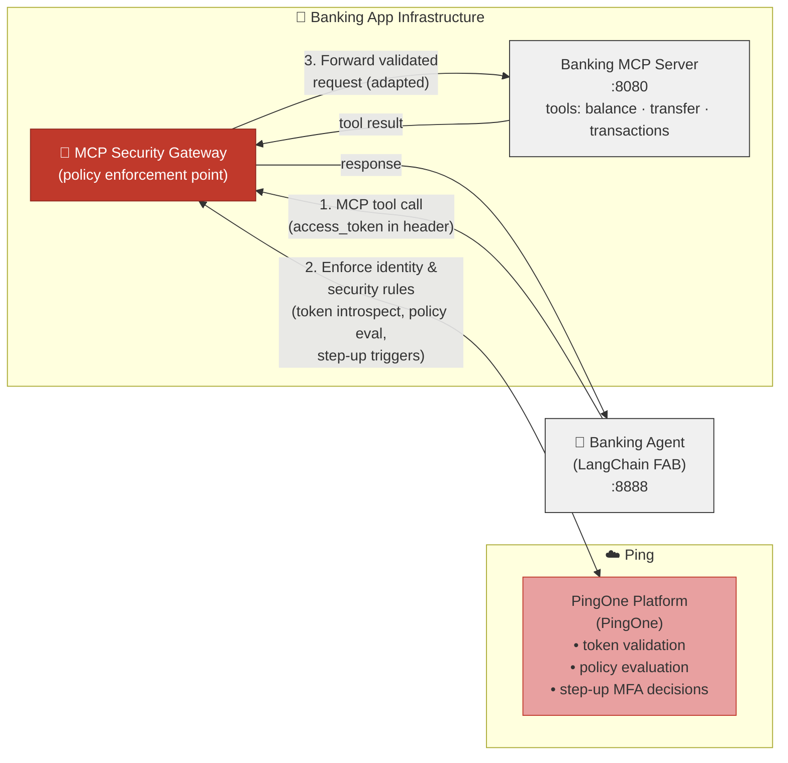

# Banking Demo — PingOne Edition

> ⚠️ **Disclaimer:** This is an independent community demo project. It is **not** created, endorsed, or supported by PingOne or ForgeRock. Use at your own risk. No warranty is provided, express or implied.

Standalone AI-powered banking demo using PingOne for authentication and **RFC 8693 Token Exchange** so the AI agent can securely access banking data on behalf of users.

This is a **completely standalone** project — it can be handed to anyone and run independently.

**AI assistants / agents:** follow **[CLAUDE.md](CLAUDE.md)** (repo conventions, regression guard, verification).

## Components

| Component | Port | Description |
|---|---|---|
| `banking_api_ui` | 3000 | React frontend (admin + end-user dashboards) |
| `banking_api_server` | 3001 | Express REST API — **Backend-for-Frontend (BFF)** with PingOne OAuth; tokens stay server-side |
| `banking_mcp_server` | 8080 | MCP tool server for the AI agent |
| `langchain_agent` | 8000 | LangChain + OpenAI AI banking agent |

## New Machine Setup

Two paths depending on whether you are starting fresh or moving an existing configuration.

---

### Path A — Fresh install (first time on this machine)

**Prerequisites:** Node 20+, npm 9+, Git, [mkcert](https://github.com/FiloSottile/mkcert)

#### 1. One-time machine prep (run once per machine, not per repo)

```bash
brew install mkcert      # macOS — skip if already installed
mkcert -install          # installs the local CA into the system trust store
echo '127.0.0.1  api.pingdemo.com' | sudo tee -a /etc/hosts
```

#### 2. Clone and install

```bash
git clone https://github.com/curtismu7/banking-demo.git
cd banking-demo
cd banking_api_server && npm install && cd ..
cd banking_mcp_server  && npm install && cd ..
cd banking_api_ui      && npm install && cd ..
```

#### 3. Start all services

```bash
./run-bank.sh
```

`run-bank.sh` will:

- Generate TLS certs automatically if mkcert is installed
- Create a `.env` with a generated `SESSION_SECRET` on first start
- Launch API (3001), UI (4000), MCP (8080), and LangChain agent (8888)

#### 4. Configure PingOne credentials

Open **[https://api.pingdemo.com:4000/configure](https://api.pingdemo.com:4000/configure)** in your browser.  
Enter your PingOne Environment ID, admin client credentials, and user client credentials.  
The app saves them to `config.db` — no restart needed.

See **[docs/SETUP.md](docs/SETUP.md)** for the full PingOne app configuration (grant types, redirect URIs, scopes).

---

### Path B — Migrate from another machine

If you already have a working setup on Machine A and want to bring it to Machine B with all your PingOne config, data, and environment intact.

#### On Machine A — export

```bash
cd banking_api_server
npm run data:export
# Creates banking-export-<timestamp>.tar.gz in banking_api_server/
```

The archive includes `config.db`, `banking.db`, all data files, and `.env`.  
It excludes `sessions.db` (machine-bound) and `certs/` (must be regenerated).

> **Security:** The archive contains your `.env` and database secrets. Transfer it via `scp` or encrypted USB — do not commit to git or upload to public storage.

#### On Machine B — set up the machine, then import

```bash
# 1. One-time machine prep (same as Path A step 1)
brew install mkcert && mkcert -install
echo '127.0.0.1  api.pingdemo.com' | sudo tee -a /etc/hosts

# 2. Clone and install
git clone https://github.com/curtismu7/banking-demo.git
cd banking-demo
cd banking_api_server && npm install && cd ..
cd banking_mcp_server  && npm install && cd ..
cd banking_api_ui      && npm install && cd ..

# 3. Copy the archive from Machine A, then import
cd banking_api_server
npm run data:import -- /path/to/banking-export-<timestamp>.tar.gz

# 4. Generate TLS certs (machine-bound — not in the archive)
cd ../certs && mkcert api.pingdemo.com localhost 127.0.0.1 && cd ..

# 5. Start
./run-bank.sh
```

The import script:

- Backs up existing `data/persistent/` before writing anything
- Restores all data files and `.env`
- Runs a config health check and shows a rollback command if anything fails
- Prints next steps including cert generation if certs are missing

#### Verify the import worked

Open **[https://api.pingdemo.com:4000/configure](https://api.pingdemo.com:4000/configure)** — it should show "Import verified" with your PingOne credentials loaded.

---

### Troubleshooting new machine setup

| Symptom | Likely cause | Fix |
|---|---|---|
| Browser shows cert error | Certs not generated or CA not trusted | Run `mkcert -install` then `cd certs && mkcert api.pingdemo.com localhost 127.0.0.1` |
| `api.pingdemo.com` doesn't resolve | `/etc/hosts` entry missing | `echo '127.0.0.1 api.pingdemo.com' \| sudo tee -a /etc/hosts` |
| `/configure` shows all fields blank after import | `.env` encryption key mismatch | Re-import with the original archive; ensure `.env` from the source machine was included |
| `better-sqlite3` binary error on start | Node version mismatch | `cd banking_api_server && npm rebuild better-sqlite3` |
| Import fails with "server is running" | Server must be stopped before import | `./run-bank.sh stop` then retry import |

---

## What This Demo Does

See **[docs/FEATURES.md](docs/FEATURES.md)** — demo scenarios, full feature matrix, 20-minute pitch checklist.  
See **[docs/RFC-STANDARDS.md](docs/RFC-STANDARDS.md)** — every RFC and standard implemented, compliance level, and known gaps.

## Configuration

See **[docs/SETUP.md](docs/SETUP.md)** (§ 2 — PingOne Application Configuration and § 3 — Environment Variables) for the full configuration reference, including all required env vars and their PingOne source.

```

## Architecture

```
┌─────────────────────────────────────────────────────────┐
│              Banking Digital Assistant                    │
│                                                           │
│  banking_api_ui (:3000)   ←→   banking_api_server (:3001) │
│       React UI                  Express banking API        │
│                                    ↑ JWT validation        │
│                                    │ via PingOne JWKS      │
│                                                           │
│  langchain_agent (:8888)  ←→   banking_mcp_server (:8080) │
│    LangChain + OpenAI           MCP tools for banking      │
│           ↓ Token Exchange                                 │
│    oauth-playground (:3001)  (or PingOne directly)        │
└─────────────────────────────────────────────────────────┘
                        ↓
              PingOne (auth.pingone.com)
              Environment: b9817c16-...
```

## Reference Architecture (i4ai Token Exchange Flow)

The diagram in **[i4ai-ref-arch.mmd](i4ai-ref-arch.mmd)** illustrates the complete token exchange flow for delegated AI agent access in this banking demo:

1. **Agent context (no user subject)** — Agent requests tool list with its own credentials; authorization server returns tools matching agent's scopes
2. **User context required** — User authenticates via web app and requests access to banking data through the chatbot
3. **Subject token (user → agent)** — Chatbot requests a scoped token for the agent with `may_act` claim indicating agent can act on behalf of user
4. **RFC 8693 Token Exchange** — Agent exchanges user token + agent token for a delegated token scoped to MCP gateway, carrying both `sub: user` and `act: agent1`
5. **Downstream delegation** — Gateway exchanges for MCP-scoped token, MCP exchanges for resource-server-scoped token; each hop re-issues with same delegation chain
6. **Authorization decisions** — Ping Authorize validates token claims, scope, and tool policy at each hop; Resource Server validates final token before returning data

See **[README (mermaid).md](README%20(mermaid).md)** for detailed token operations, introspection patterns, delegation chain semantics, and standards references.

---

## Key Changes from Original (ForgeRock/PingOne AI IAM Core → PingOne)

| Component | Before | After |
|---|---|---|
| AS endpoints | `openam-*.forgeblocks.com/am/oauth2/...` | `auth.pingone.com/{envId}/as/...` |
| Token validation | **Runtime-switchable** (Phase 97): `introspection` (RFC 7662, default — real-time, detects revoked) or `jwt` (RFC 7519, fast, offline). Toggle via Config UI or `POST /api/config/validation-mode`. Set default with `VALIDATION_MODE` env var. | Same modes available |
| Token Exchange | Not implemented | Implemented — `banking_api_server/services/agentMcpTokenService.js` performs RFC 8693 exchange on every `POST /api/mcp/tool` when `MCP_RESOURCE_URI` is set |
| MCP server config | `PINGONE_BASE_URL=*.PingOneentity.com` | `PINGONE_BASE_URL=https://auth.pingone.com/{envId}/as` |

## Services

| Service | Port | Description |
|---|---|---|
| `banking_api_server` | 3001 | Express REST API — banking accounts, transactions, admin |
| `banking_api_ui` | 3000 | React frontend for admin/customer portal |
| `banking_mcp_server` | 8080 | TypeScript MCP server — exposes banking tools to AI agents |
| `langchain_agent` | 8888 | LangChain agent + WebSocket frontend |

## Token Exchange Flow (RFC 8693)

The **Backend-for-Frontend (BFF)** — the `banking_api_server` — performs RFC 8693 Token Exchange on the **server side** — the browser never sees raw OAuth tokens. On every `POST /api/mcp/tool` call, `agentMcpTokenService.js` runs:

```text
1. Retrieve the user access token (stored in server-side session)
2. POST {issuer}/as/token
     grant_type = urn:ietf:params:oauth:grant-type:token-exchange
     subject_token = <user access token>
     subject_token_type = urn:ietf:params:oauth:token-type:access_token
     audience = <MCP_RESOURCE_URI>          -- binds audience to MCP server
     scope = <tool-scopes>                  -- e.g. banking:accounts:read
3. PingOne validates may_act, issues the MCP access token (delegated, MCP audience)
4. BFF opens WebSocket to banking_mcp_server with the MCP access token as Bearer
```

Optional delegation path (`USE_AGENT_ACTOR_FOR_MCP=true`):

```text
     actor_token = <agent access token>   -- client-credentials token
     actor_token_type = urn:ietf:params:oauth:token-type:access_token
     -- MCP access token carries act: { sub: "<agent-client-id>" }  per RFC 8693 s4.1
```

The exchange is **dormant until configured** — if `MCP_RESOURCE_URI` is not set, the BFF does not send a token to MCP for that path (local tool fallback; user access token stays on the BFF). To activate:

| Env var | Purpose |
| --- | --- |
| `MCP_RESOURCE_URI` | Audience URI for the MCP server (activates the exchange) |
| `USE_AGENT_ACTOR_FOR_MCP` | `true` to add `actor_token` (adds `act` claim to the MCP access token) |
| `AGENT_OAUTH_CLIENT_ID` | Agent OAuth client ID (required when actor path is on) |

Required in PingOne: enable the token-exchange grant type on the Backend-for-Frontend (BFF) client and configure a `may_act` / actor policy so PingOne will accept the exchange.

## PingOne Configuration Required

In your PingOne environment (`b9817c16-9910-4415-b67e-4ac687da74d9`), you need:

1. **Super Banking Worker Token App** (client_credentials, type: `WORKER`) — PingOne Management API access
   - Already configured: `66a4686b-9222-4ad2-91b6-03113711c9aa`

2. **Web Application** (auth_code + PKCE) — for user login
   - Already configured: `a4f963ea-0736-456a-be72-b1fa4f63f81f`

3. **Token Exchange** policy on the Backend-for-Frontend (BFF) client — allows the Backend-for-Frontend (BFF) to exchange user tokens for MCP-audience tokens
   - In PingOne: Applications → your Backend-for-Frontend (BFF) app → Grant Types → enable **Token Exchange**
   - Add a Token Exchange policy: subject token issuer = this PingOne environment; allowed audience = value of `MCP_RESOURCE_URI`
   - Add a `may_act` claim to tokens issued to end-users (Attribute Mappings) so the Backend-for-Frontend (BFF)'s client_id appears in `may_act.client_id`

## MCP Security Gateway — Potential Architecture

> **Note:** This is not how the app is currently set up. It illustrates how an **MCP Security Gateway**
> (as defined by PingOne) could be introduced to centralize identity enforcement between the
> Banking Agent and the Banking MCP Server — without changing either endpoint's code.



**How it would work in practice:**

| Step | Current (no gateway) | With MCP Security Gateway |
|---|---|---|
| 1. Agent calls MCP tool | Direct WebSocket to `:8080` | HTTPS call to gateway — MCP traffic intercepted |
| 2. Identity enforcement | MCP server validates token itself | Gateway calls PingOne to validate token, evaluate policies, trigger step-up MFA |
| 3. Downstream adaptation | Token passed as-is | Gateway can exchange token, strip/add claims, or adapt auth scheme for the MCP server |

**Key benefits this would add to the banking demo:**
- Centralised audit log of every MCP tool call
- Policy-driven step-up MFA before high-risk tools (e.g. `transfer_funds`)
- Token exchange at the gateway — MCP server never sees the user's raw token
- Swap out the MCP server without changing agent auth logic

---

## Vercel Deployment

The app is deployed to Vercel as a single serverless function (`api/handler.js`) with the React UI served as static files. Vercel spins up multiple function instances, so sessions must be persisted externally in [Upstash Redis](https://upstash.com).

### Quick Vercel Setup

Run the interactive setup wizard — it detects conflicts, validates Upstash connectivity, generates a session secret, and optionally pushes values to Vercel via the CLI:

```bash
npm run setup:vercel
```

To check your current config without making changes:

```bash
npm run setup:vercel:check
```

The wizard writes a `.env.vercel.local` file (gitignored). Copy these values to **Vercel Dashboard → Project → Settings → Environment Variables**.

### Required Environment Variables

| Variable | Description |
|---|---|
| `UPSTASH_REDIS_REST_URL` | Upstash REST URL (`https://…upstash.io`) |
| `UPSTASH_REDIS_REST_TOKEN` | Upstash REST token |
| `SESSION_SECRET` | 32+ char random string — generate: `node -e "console.log(require('crypto').randomBytes(32).toString('hex'))"` |
| `PINGONE_ENVIRONMENT_ID` | PingOne env ID |
| `PINGONE_REGION` | `com` / `eu` / `ca` / `asia` |
| `PINGONE_AI_CORE_CLIENT_ID` | Admin OAuth client ID |
| `PINGONE_AI_CORE_CLIENT_SECRET` | Admin OAuth client secret |
| `PINGONE_AI_CORE_REDIRECT_URI` | `https://<vercel-url>/api/auth/oauth/callback` |
| `PINGONE_AI_CORE_USER_CLIENT_ID` | Customer OAuth client ID |
| `PINGONE_AI_CORE_USER_CLIENT_SECRET` | Customer OAuth client secret |
| `PINGONE_AI_CORE_USER_REDIRECT_URI` | `https://<vercel-url>/api/auth/oauth/user/callback` |
| `REACT_APP_CLIENT_URL` | `https://<vercel-url>.vercel.app` |
| `MCP_SERVER_URL` | `wss://…` — deploy `banking_mcp_server` to Railway/Render/Fly (Vercel doesn't support WebSocket) |
| `NODE_ENV` | `production` |
| `CORS_ORIGIN` | Same as `REACT_APP_CLIENT_URL` |

> **Important:** Do NOT set `REDIS_URL` to an `https://` URL — it must be `redis://` or `rediss://` wire protocol, or use `UPSTASH_REDIS_REST_URL` instead. The setup wizard detects and fixes this automatically.

> **Important:** Never set `SKIP_TOKEN_SIGNATURE_VALIDATION=true` — the server will refuse to start in production.

### Session Store: Why Upstash REST?

Vercel's serverless environment kills TCP connections between invocations. `node-redis` (wire protocol) is unreliable because every cold start incurs a TLS handshake that races the session read/write window. The app uses `@vercel/kv` (Upstash REST API over HTTP) — stateless by design, no connection to re-establish.

### Post-Deploy Verification

After deploying, sign out and back in, then check:

```
GET /api/auth/debug
```

You want:
- `sessionStoreType: "upstash-rest"`
- `sessionStoreHealthy: true`
- `sessionRestored: false` (after a fresh login — not a cookie-only fallback)

### PingOne Redirect URIs

Add these to your PingOne application after getting your Vercel URL:
- Admin: `https://<your-vercel-url>/api/auth/oauth/callback`
- Customer: `https://<your-vercel-url>/api/auth/oauth/user/callback`

### Common Vercel Issues

| Symptom | Cause | Fix |
|---|---|---|
| `sessionStoreHealthy: false` | Bad Upstash credentials | Run `npm run setup:vercel` to re-enter and test |
| `sessionRestored: true` + `accessTokenStub: true` | Session store failing silently | Check `sessionStoreError` in `/api/auth/debug` |
| `invalid_state` on login | No session store | Add `UPSTASH_REDIS_REST_URL` + `UPSTASH_REDIS_REST_TOKEN` |
| `session_error` redirect | Session write failed before PingOne redirect | Fix session store; sign out and try again |
| Agent shows "connecting…" | `MCP_SERVER_URL` not set | Set `MCP_SERVER_URL=wss://…` in Vercel env vars |
| Build fails with lint error | `CI=true` treats warnings as errors | Ensure `"CI": "false"` in `vercel.json` build.env |
| Redirect URI mismatch | PingOne URI ≠ Vercel URL | Update PingOne app redirect URIs |

---

## Environment Files

| File | Purpose |
|---|---|
| `.env.vercel.example` | Template for all Vercel environment variables |
| `.env.vercel.local` | Your local copy (gitignored) — generated by `npm run setup:vercel` |
| `banking_api_server/.env` | Local dev config (PingOne credentials, port) |
| `banking_mcp_server/.env.development` | MCP server config (copy to `.env` before running) |
| `langchain_agent/.env` | Agent config (OpenAI key, PingOne endpoints) |
| `banking_api_ui/.env` | React frontend config |
