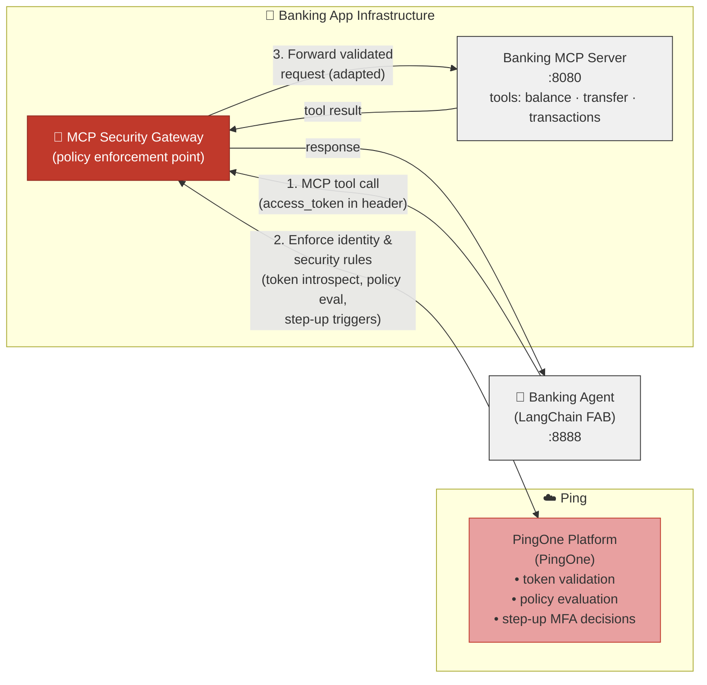

# Banking Demo — PingOne Edition

> ⚠️ **Disclaimer:** This is an independent community demo project. It is **not** created, endorsed, or supported by PingOne or ForgeRock. Use at your own risk. No warranty is provided, express or implied.

Standalone AI-powered banking demo using PingOne for authentication and **RFC 8693 Token Exchange** so the AI agent can securely access banking data on behalf of users.

This is a **completely standalone** project — it can be handed to anyone and run independently.

**AI assistants / agents:** follow **[CLAUDE.md](CLAUDE.md)** (repo conventions, regression guard, verification).

## Components

| Component | Port | Description |
|---|---|---|
| `banking_api_ui` | 4000 | React frontend (admin + end-user dashboards) |
| `banking_api_server` | 3001 | Express REST API — **Backend-for-Frontend (BFF)** with PingOne OAuth; tokens stay server-side |
| `banking_mcp_server` | 8080 | TypeScript MCP tool server for the AI agent |
| `banking_mcp_gateway` | 3005 | MCP Security Gateway — enforces policies and performs token exchange |
| `banking_agent_service` | 3006 | LangGraph reasoning service for the canonical agent (driven by BFF) |
| `banking_hitl_service` | 3009 | Human-in-the-Loop consent challenge service |
| `banking_mcp_invest` | 8081 | Specialized MCP server for investment tools |
| `banking_mortgage_service` | 8082 | Mortgage service backend |
| `langchain_agent` | 8888 | Python LangChain + OpenAI demo agent (separate cross-stack exhibit) |

## New Machine Setup

### TL;DR — one-line install

If you have **Node 20+** (Node 20, 22, or 24 — any modern LTS works) and **git** already, this is all you need:

```bash
curl -fsSL https://raw.githubusercontent.com/curtismu7/AI-demo/main/install.sh | bash
```

The installer:

1. Confirms the install directory (defaults to `./AI-demo` in your current dir; you can hit Enter or abort).
2. Clones the repo (or pulls latest if it already exists).
3. Runs `npm run setup:fresh` inside it — which prompts for PingOne worker creds via a localhost browser form, provisions all PingOne resources, and writes `banking_api_server/.env`.

When done: `cd AI-demo && ./run-demo.sh`. That's it.

#### Where will it install?

The installer creates `AI-demo/` **in your current working directory**. Pick where you want it before you run the curl line:

```bash
# Suggested: install under your home directory
cd ~
curl -fsSL https://raw.githubusercontent.com/curtismu7/AI-demo/main/install.sh | bash
# → /Users/you/AI-demo/

# Or somewhere temporary
cd /tmp
curl -fsSL https://raw.githubusercontent.com/curtismu7/AI-demo/main/install.sh | bash
# → /tmp/AI-demo/
```

The installer prints the absolute target path **before** doing anything and asks `Proceed? [Y/n]`. Press `n` to abort if the path is wrong, then re-run from a different `cwd`.

#### Override the install path

```bash
curl -fsSL https://raw.githubusercontent.com/curtismu7/AI-demo/main/install.sh | INSTALL_DIR=~/work/AI-demo bash
```

Other env-var overrides (mostly for testing/CI):

| Variable | Default | Effect |
|---|---|---|
| `INSTALL_DIR` | `$PWD/AI-demo` | Target install path (absolute or relative). |
| `BANKING_BRANCH` | `main` | Branch to check out. |
| `REPO_URL` | github.com/curtismu7/AI-demo | Override the git remote. |
| `ASSUME_YES=1` | (unset) | Skip the confirmation prompt. |
| `DRY_RUN=1` | (unset) | Print every command without executing. Useful to preview what will happen. |

#### Migrating from another machine

Pass the tar archive as an argument:

```bash
curl -fsSL https://raw.githubusercontent.com/curtismu7/AI-demo/main/install.sh | bash -s -- /path/to/banking-export-<timestamp>.tar.gz
```

`bash -s --` is the standard pattern for forwarding arguments through a curl-pipe. The installer chains import → bootstrap automatically; if the archive is older than the `MCP_GW` / `AGENT` apps were added, bootstrap fills the gap.

#### Re-running the installer

Safe. If `AI-demo/` already exists with a git checkout, the installer does `git pull --ff-only` instead of `git clone`, then re-runs setup:fresh. PingOne provisioning is idempotent — already-existing resources are detected and reused; redirect URIs on existing apps are refreshed if they don't match.

### If you already cloned the repo

Run the inner command directly — same flow, skips the clone:

```bash
cd AI-demo
npm run setup:fresh                              # brand-new install
npm run setup:fresh -- /path/to/archive.tar.gz   # migration
```

Both flows end at the same place: a working `.env`, restored data (if you imported one), provisioned PingOne resources, ready for `./run-demo.sh`. The sections below walk through the prerequisites and the full sequence.

### Defaults & presets — what each command does

Both `npm run setup:fresh` and `npm run import` print this same table at the start of every interactive run, then ask "Continue with these defaults? [Y/n]" so you can bail out and pick a different recipe before any provisioning starts.

#### `npm run setup:fresh` defaults

| Setting               | Default                          | Override |
|-----------------------|----------------------------------|----------|
| Confirm install dir   | ON                               | `--yes` / `--from-installer` |
| Cleanup prior state   | PROMPT (only if state found)     | `--clean` (force) / `--no-clean` (skip) |
| Wipe PingOne env      | OFF                              | `--reset-pingone` |
| Recreate demo apps    | OFF                              | `--recreate-apps` |
| Bootstrap PingOne     | ON (always; idempotent)          | — |
| Helix LLM config      | PROMPT (default **Yes**)         | `--helix` (skip prompt) / `--skip-helix` (force-no) |
| Browser cred form     | ON                               | `--no-browser` (terminal only) |
| Read PINGONE_BOOTSTRAP_* | OFF                           | `--non-interactive` (CI) |

Helix env vars (auto-config in non-interactive mode if all five are set): `HELIX_BASE_URL`, `HELIX_API_KEY`, `HELIX_ENVIRONMENT_ID`, `HELIX_AGENT_ID`, `HELIX_PROMPT_FIELD_ID`.

#### `npm run import` defaults

| Setting                | Default      | Override |
|------------------------|--------------|----------|
| Server-running check   | ON (FATAL)   | — (abort if server is up) |
| Backup before extract  | ON           | — (always taken) |
| Skip machine-bound     | ON           | — (`sessions.db`, `runtimeData.json`) |
| Bootstrap PingOne      | OFF          | use `npm run setup:fresh` to chain |
| Helix LLM config       | OFF          | use `npm run setup:fresh` to chain |

#### Presets — copy & paste

```bash
# 1) Fresh install on this machine (the default)
npm run setup:fresh

# 2) Migrate from another machine using a bundle
npm run setup:fresh -- ~/banking-export-2026-XX-XX.tar.gz

# 3) Nuclear reset (wipe local state AND PingOne env, then re-provision)
npm run reset

# 4) CI / scripted (no prompts; needs PINGONE_BOOTSTRAP_* + HELIX_* env vars)
npm run setup:fresh -- --non-interactive --skip-helix

# 5) Just import a bundle (no PingOne work, no Helix)
npm run import -- ~/banking-export-2026-XX-XX.tar.gz

# 6) Just check this machine can import (no side effects)
npm run import -- --preflight-only ~/banking-export-2026-XX-XX.tar.gz
```

### Worked example — full wipe and start from blank

When something has drifted (`.env` got mangled, PingOne apps don't match the local state, you're testing a fresh-install path against a tenant you've already provisioned) the cleanest reset is one command:

```bash
cd AI-demo
npm run reset
```

What this runs end-to-end (it's `setup:fresh --clean --reset-pingone` under the hood):

| Phase | What happens |
|-------|--------------|
| 1. Confirm install dir | You see the install path, confirm. |
| 2. Cleanup prior state | `--clean` → deletes `.env`, `data/persistent/`, `data/sessions.db`, `data/backups/`, `certs/*.pem`. `.env` is backed up to `.env.pre-cleanup-<timestamp>` first. |
| 3. Install dependencies | `npm install` if `node_modules/` is missing. |
| 4. `/etc/hosts` check | Confirms `127.0.0.1 api.ping.demo` is present. |
| 5. PingOne wipe | `--reset-pingone` → opens the cred form, then asks you to type the env id to confirm. Deletes every `Demo *` app, resource server, group, custom attribute, and demo user (the worker you authenticated with is preserved). |
| 6. Bootstrap PingOne | Re-creates everything from scratch and writes a fresh `.env`. |
| 7. Helix LLM config | Prompts (default Yes); collects 5 fields, persists encrypted to `config.db`. |

After it completes:

```bash
./run-demo.sh                      # start everything against the new state
./run-demo.sh status               # verify all 8 services are healthy
```

If you want to import a known-good bundle as the final step instead of letting bootstrap re-provision, use `npm run reset:import -- /path/to/bundle.tar.gz` (same wipe + the bundle on top).

### Uninstall — tear down everything

When you're done with the demo on this machine and want to free disk / leave the PingOne tenant clean:

```bash
cd AI-demo
npm run uninstall
```

What it does (4 phases — each can be skipped via `--keep-*` flags):

| Phase | What happens |
|-------|--------------|
| 1. Stop services | `./run-demo.sh stop` — gracefully stops API, UI, MCP server, MCP gateway, agent service, MCP invest, HITL, LangChain agent. |
| 2. Wipe PingOne env | Type-the-env-id confirmation, then deletes every Demo app, resource server, group, custom attribute, and demo user in your PingOne env. |
| 3. Delete local state | Removes `banking_api_server/.env`, `data/persistent/`, `data/sessions.db*`, `data/backups/`, `certs/`, `setup.log`. |
| 4. Delete node_modules | Removes `node_modules/` + `dist/` in all 7 Node services (~2 GB). |

Skip individual phases:

```bash
npm run uninstall -- --keep-pingone        # local cleanup only
npm run uninstall -- --keep-node-modules   # don't free the 2 GB of deps
npm run uninstall -- --keep-services       # services are already down
npm run uninstall -- --keep-local          # only stop services + wipe PingOne
```

What `uninstall` does **NOT** remove (you do these by hand):

- The repo directory itself — `rm -rf AI-demo` after the script runs
- Source code (it's all in the git tree; not deleted)
- Your shell's nvm bootstrap (`~/.zshrc` / `~/.bashrc` lines)
- `mkcert` root CA (machine-wide; affects other apps)
- Anything in your Helix tenant — the script doesn't touch Helix

Run `npm run uninstall -- --help` for the full flag list.

### Other npm shortcuts

```bash
# Day-to-day
npm run pingone:bootstrap          # re-provision PingOne (idempotent; reuses existing apps)
npm run import -- archive.tar.gz   # restore .env + data from a tar (no PingOne work)
npm run export                     # create a banking-export-<timestamp>.tar.gz

# Destructive (require confirmation prompts)
npm run pingone:recreate           # delete 'Demo *' apps and recreate
npm run pingone:wipe               # NUCLEAR: delete every app/resource/group/user in the PingOne env
npm run reset                      # full wipe + start blank: local state + PingOne + re-provision
npm run reset:import -- archive.tar.gz
                                   # full wipe + import (wipe → import → bootstrap)
npm run uninstall                  # full tear-down: stop services + wipe PingOne + delete local + node_modules
```

`reset` and `pingone:wipe` both ask you to type the environment id to confirm before destroying anything.

---

### Path A — Fresh install (first time on this machine)

**Prerequisites:** Node **20 or newer** (Node 20, 22, 24 — any modern LTS; verify with `node --version`), npm 9+, Git, [mkcert](https://github.com/FiloSottile/mkcert)

> **Heads up — Node 20+ must be active in the shell you run commands in.** If you installed Node via nvm (recommended), nvm is a shell function — opening a new terminal that doesn't auto-load it gives `zsh: command not found: nvm`. Make sure your `~/.zshrc` (or `~/.bashrc`) sources nvm; see [§ 0 below](#0-node-version-setup-skip-if-node---version-shows-v20-or-newer).

#### 0. Node version setup (skip if `node --version` shows `v20.…` or newer)

```bash
# Install nvm if you don't have it yet:
curl -o- https://raw.githubusercontent.com/nvm-sh/nvm/v0.40.1/install.sh | bash

# Make nvm load in EVERY new terminal — append to ~/.zshrc (zsh) or ~/.bashrc (bash):
cat >> ~/.zshrc <<'EOF'
export NVM_DIR="$HOME/.nvm"
[ -s "$NVM_DIR/nvm.sh" ] && \. "$NVM_DIR/nvm.sh"
EOF

# Apply to the current shell, then install + select a Node 20+ release.
# Any of these work — pick one. Newer versions get longer support.
source ~/.zshrc
nvm install 20 && nvm use 20      # Node 20 LTS (active LTS through 2026-04)
# nvm install 22 && nvm use 22    # Node 22 LTS (active LTS through 2027-04)
# nvm install 24 && nvm use 24    # Node 24 LTS (active LTS through 2028-04)
```

#### 1. One-time machine prep (run once per machine, not per repo)

```bash
brew install mkcert      # macOS — skip if already installed
mkcert -install          # installs the local CA into the system trust store
echo '127.0.0.1  api.ping.demo' | sudo tee -a /etc/hosts
```

#### 2. Clone — let `./run-demo.sh` do the rest

```bash
git clone https://github.com/curtismu7/AI-demo.git
cd AI-demo
./run-demo.sh
```

That's it. The script's dependency loop installs `node_modules` and runs the
TypeScript build (`tsc`) for every Node service before launching anything, and
aborts with a clear error if any install or build fails.

If you'd rather pre-install the deps yourself (e.g. before running on a
disconnected network), here's the full set — all seven Node services need
`npm install`, and the four TypeScript ones additionally need `npm run build`:

```bash
# Plain JS — install only
cd banking_api_server   && npm install                       && cd ..
cd banking_hitl_service && npm install                       && cd ..
cd banking_mortgage_service && npm install                   && cd ..

# React app (CRA) — install with --legacy-peer-deps; build is handled at runtime
cd banking_api_ui       && npm install --legacy-peer-deps    && cd ..

# TypeScript services — install + tsc compile to dist/
cd banking_mcp_server   && npm install && npm run build      && cd ..
cd banking_mcp_gateway  && npm install && npm run build      && cd ..
cd banking_agent_service && npm install && npm run build     && cd ..
cd banking_mcp_invest   && npm install && npm run build      && cd ..
```

> `banking_api_ui` ships an `.npmrc` with `legacy-peer-deps=true` so plain `npm install` also works there — the explicit flag above is belt-and-suspenders if `.npmrc` is ever lost. CRA/`react-scripts` has an unresolvable `peerOptional` for TypeScript that npm 7+ rejects by default.

#### 3. Start all services

> Run from the `AI-demo` repo root. `./run-demo.sh` is repo-local — `cd AI-demo` first if you opened a new terminal.

```bash
cd /path/to/AI-demo   # if you're not already there
./run-demo.sh
```

`run-demo.sh` will:

- Source `~/.nvm/nvm.sh` and `nvm use 20` itself if nvm isn't yet loaded in the current shell (so it works from a fresh terminal that doesn't auto-load nvm)
- Generate TLS certs automatically if mkcert is installed
- Create a `.env` with a generated `SESSION_SECRET` on first start
- Launch API (3001), UI (4000), MCP (8080), and LangChain agent (8888)

> If nvm isn't installed at all, the script falls back to the same guidance as § 0 and exits with instructions.

#### 4. Provision PingOne (recommended) — `npm run setup:fresh`

This single command creates everything PingOne needs (resource servers, scopes, applications, demo users with passwords) and writes the credentials to `banking_api_server/.env`. It pops a localhost form for your worker creds, so you don't paste secrets into a terminal.

**Step 1 (you, in PingOne Admin Console):** create a worker app with the **Identity Data Admin** role. Note the Environment ID, Region, Client ID, and Client Secret.

**Step 2 (in this repo, from the root):**

```bash
npm run setup:fresh
```

The browser pops a form. Submit your four worker creds. The script:

1. Provisions resource servers (`Demo API`, `Demo MCP Server`, `Demo MCP Gateway`)
2. Creates ~25 scopes (`banking:*`, `admin:*`, `users:*`, `p1:*`, `banking:mcp:invoke`)
3. Creates **7 applications** (Admin, User, MCP Server, Worker, MCP Exchanger, MCP Gateway, Agent)
4. Creates two demo users with generated passwords (`bankuser`, `bankadmin`)
5. Adds the `bankingPrincipalUserId` schema attribute and SPEL/may_act token claims
6. Writes `banking_api_server/.env` with all the new client IDs and secrets (preserving your `SESSION_SECRET` so `config.db` stays decryptable)

The script is **idempotent** — re-running it on a fully-provisioned environment reports "exists" for each resource and exits cleanly.

**Other modes:**
- `npm run setup:fresh -- --no-browser` — terminal prompts only (SSH / headless boxes)
- `cd banking_api_server && npm run pingone:bootstrap:ci` with `PINGONE_BOOTSTRAP_*` env vars set — non-interactive (CI / automation)

**Prefer to enter credentials manually instead?** Open **[https://api.ping.demo:4000/configure](https://api.ping.demo:4000/configure)** in your browser after `./run-demo.sh` and enter your PingOne Environment ID and OAuth client credentials. The app saves them to `config.db` — no restart needed. Note: this manual path only sets the admin/user OAuth clients. The MCP gateway and agent service still need `MCP_GW_CLIENT_ID` / `AGENT_CLIENT_ID` in `.env`, which `setup:fresh` provides automatically.

See **[docs/SETUP.md](docs/SETUP.md)** for the full PingOne app configuration reference.

---

### Path B — Migrate from another machine

If you already have a working setup on Machine A and want to bring it to Machine B with all your PingOne config, data, and environment intact.

#### On Machine A — export

```bash
cd banking_api_server
npm run data:export
# Creates banking-export-<timestamp>.tar.gz in banking_api_server/
```

The archive includes `config.db`, `banking.db`, all data files, and `.env`.  
It excludes `sessions.db` (machine-bound) and `certs/` (must be regenerated).

> **Security:** The archive contains your `.env` and database secrets. Transfer it via `scp` or encrypted USB — do not commit to git or upload to public storage.

#### On Machine B — set up the machine, then run setup:fresh with the tar

```bash
# 1. Node 20+ in this shell (see Path A § 0 if nvm isn't loaded yet)
nvm use 20   # or: source ~/.zshrc && nvm use 20  (or use 22 / 24 — any LTS)

# 2. One-time machine prep (same as Path A § 1)
brew install mkcert && mkcert -install
echo '127.0.0.1  api.ping.demo' | sudo tee -a /etc/hosts

# 3. Clone (run-demo.sh installs all deps for you on first start)
git clone https://github.com/curtismu7/AI-demo.git
cd AI-demo

# 4. Copy the archive from Machine A, then import + provision in one step
npm run setup:fresh -- /path/to/banking-export-<timestamp>.tar.gz

# 5. Generate TLS certs (machine-bound — not in the archive)
mkdir -p certs && cd certs && mkcert api.ping.demo localhost 127.0.0.1 && cd ..

# 6. Start
./run-demo.sh
```

> Step 4 chains `data:import` then `pingone:bootstrap`. If your archive already has full PingOne config (a recent export with `MCP_GW_CLIENT_ID` / `AGENT_CLIENT_ID`), the bootstrap step is skipped automatically and the command exits at "import complete." If the archive is older or PingOne config is missing, the browser pops the worker-cred form so you can finish provisioning in one go.

> The export, import, and bootstrap scripts all pre-flight your Node version against the repo's `engines.node` and bail with a clear message if you're on the wrong major — so if step 4 dies with "Node major 20 required," that's the cue to fix step 1 before retrying.

What the import portion of `setup:fresh` does:

- Backs up existing `data/persistent/` before writing anything
- Restores all data files and `.env`
- Runs a config health check and shows a rollback command if anything fails
- Hands off to bootstrap when needed; otherwise prints "import complete" and exits

#### Verify the import worked

Open **[https://api.ping.demo:4000/configure](https://api.ping.demo:4000/configure)** — it should show "Import verified" with your PingOne credentials loaded.

---

### Troubleshooting new machine setup

| Symptom | Likely cause | Fix |
|---|---|---|
| `zsh: command not found: nvm` | nvm isn't loaded in this shell — it's a shell function, not a binary on PATH | `export NVM_DIR="$HOME/.nvm" && [ -s "$NVM_DIR/nvm.sh" ] && \. "$NVM_DIR/nvm.sh"` (one-shot), then add those two lines to `~/.zshrc` (or `~/.bashrc`) so new terminals pick it up automatically. See Path A § 0. |
| `zsh: no such file or directory: ./run-demo.sh` | You're not in the repo root — `./run-demo.sh` is repo-local | `cd /path/to/AI-demo` first, then `./run-demo.sh` |
| Export/import fails with `Node major 20 required, but this shell is using Node vX` | Wrong Node version active in this shell | `nvm use 20` (run nvm-load snippet above first if needed); see Path A § 0 |
| Browser shows cert error | Certs not generated or CA not trusted | Run `mkcert -install` then `cd certs && mkcert api.ping.demo localhost 127.0.0.1` |
| `api.ping.demo` doesn't resolve | `/etc/hosts` entry missing | `echo '127.0.0.1 api.ping.demo' \| sudo tee -a /etc/hosts` |
| `/configure` shows all fields blank after import | `.env` encryption key mismatch | Re-import with the original archive; ensure `.env` from the source machine was included |
| `better-sqlite3` binary error on start | Node version mismatch (binary built against a different Node major) | `nvm use 20 && cd banking_api_server && npm rebuild better-sqlite3` |
| Import fails with "server is running" | Server must be stopped before import | `./run-demo.sh stop` then retry import |
| `npm install` in `banking_api_ui` fails with `ERESOLVE` (typescript / react-scripts) | CRA's `peerOptional` typescript range trips npm 7+ resolver | `npm install --legacy-peer-deps` (or restore `banking_api_ui/.npmrc` containing `legacy-peer-deps=true`) |

---

## What This Demo Does

See **[docs/FEATURES.md](docs/FEATURES.md)** — demo scenarios, full feature matrix, 20-minute pitch checklist.  
See **[docs/RFC-STANDARDS.md](docs/RFC-STANDARDS.md)** — every RFC and standard implemented, compliance level, and known gaps.

## Configuration

See **[docs/SETUP.md](docs/SETUP.md)** (§ 2 — PingOne Application Configuration and § 3 — Environment Variables) for the full configuration reference, including all required env vars and their PingOne source.

## Testing

Run the full test suite across all services:

```bash
npm test                                   # all tests
npm run test:api-server                    # BFF tests only
npm run test:mcp-server                    # MCP unit tests
npm run test:mcp-server:integration        # MCP integration tests
npm run test:ui                            # React component tests (CI mode)
npm run test:agent                         # LangChain agent tests (Python)
npm run test:agent-ui                      # Agent frontend tests
npm run test:e2e:ui:smoke                  # Fast E2E smoke test
npm run test:e2e:ui                        # Full E2E UI test suite
npm run test:session                       # Session + BFF token tests
```

From within `banking_api_server/`, you can run targeted test suites:

```bash
cd banking_api_server
npx jest oauthStatus.regression oauthStatus.integration hitlRoute.regression hitlRoute.integration
npx jest --testPathPattern='step-up-gate|authorize-gate'
```

**Test framework:** Jest (Node/Express services), Vitest (some TypeScript packages), React Testing Library (UI components), pytest (Python agent).

## Development & Contributing

All development must follow the patterns documented in **[CLAUDE.md](CLAUDE.md)** — the canonical agent instructions for this repository. Read § 1 (**Critical Do-Not-Break Areas**) in **[REGRESSION_PLAN.md](REGRESSION_PLAN.md)** before editing protected files like `routes/oauth.js`, `middleware/auth.js`, or session/token logic.

**Key development conventions:**
- **Minimal diff discipline** — touch only what the task requires; no while-I'm-here cleanup
- **Read REGRESSION_PLAN.md § 0–1** before editing files listed there
- **UI build required** — `cd banking_api_ui && npm run build` must exit 0 after any UI change
- **Token custody rule** — the BFF (banking_api_server) is the sole token custodian; tokens never reach the browser
- **Quote secrets in .env** — special characters like `~`, `-`, `.` break shell parsing if unquoted
- **No hardcoded localhost** — all OAuth redirect URIs use the configured host (`api.ping.demo` by default), never hardcoded `localhost:3001` / `localhost:4000`

See **[CONTEXT.md](CONTEXT.md)** for glossary of terms (BFF, gateway, agent, consent, delegation); **[ARCHITECTURE.md](ARCHITECTURE.md)** for standards and architecture decisions; and **[docs/adr/](docs/adr/)** for architectural decision records.

## Architecture

```
┌─────────────────────────────────────────────────────────┐
│              Banking Digital Assistant                    │
│                                                           │
│  banking_api_ui (:4000)   ←→   banking_api_server (:3001) │
│       React UI                  Express banking API        │
│                                    ↑ JWT validation        │
│                                    │ via PingOne JWKS      │
│                                                           │
│  langchain_agent (:8888)  ←→   banking_mcp_server (:8080) │
│    LangChain + OpenAI           MCP tools for banking      │
│           ↓ Token Exchange                                 │
│    oauth-playground (:3001)  (or PingOne directly)        │
└─────────────────────────────────────────────────────────┘
                        ↓
              PingOne (auth.pingone.com)
              Environment: b9817c16-...
```

## Reference Architecture (i4ai Token Exchange Flow)

The diagram in **[i4ai-ref-arch.mmd](i4ai-ref-arch.mmd)** illustrates the complete token exchange flow for delegated AI agent access in this banking demo:

1. **Agent context (no user subject)** — Agent requests tool list with its own credentials; authorization server returns tools matching agent's scopes
2. **User context required** — User authenticates via web app and requests access to banking data through the chatbot
3. **Subject token (user → agent)** — Chatbot requests a scoped token for the agent with `may_act` claim indicating agent can act on behalf of user
4. **RFC 8693 Token Exchange** — Agent exchanges user token + agent token for a delegated token scoped to MCP gateway, carrying both `sub: user` and `act: agent1`
5. **Downstream delegation** — Gateway exchanges for MCP-scoped token, MCP exchanges for resource-server-scoped token; each hop re-issues with same delegation chain
6. **Authorization decisions** — Ping Authorize validates token claims, scope, and tool policy at each hop; Resource Server validates final token before returning data

See **[README (mermaid).md](README%20(mermaid).md)** for detailed token operations, introspection patterns, delegation chain semantics, and standards references.

---

## Key Changes from Original (ForgeRock/PingOne AI IAM Core → PingOne)

| Component | Before | After |
|---|---|---|
| AS endpoints | `openam-*.forgeblocks.com/am/oauth2/...` | `auth.pingone.com/{envId}/as/...` |
| Token validation | **Runtime-switchable** (Phase 97): `introspection` (RFC 7662, default — real-time, detects revoked) or `jwt` (RFC 7519, fast, offline). Toggle via Config UI or `POST /api/config/validation-mode`. Set default with `VALIDATION_MODE` env var. | Same modes available |
| Token Exchange | Not implemented | Implemented — `banking_api_server/services/agentMcpTokenService.js` performs RFC 8693 exchange on every `POST /api/mcp/tool` when `MCP_RESOURCE_URI` is set |
| MCP server config | `PINGONE_BASE_URL=*.PingOneentity.com` | `PINGONE_BASE_URL=https://auth.pingone.com/{envId}/as` |

## Services

| Service | Port | Description |
|---|---|---|
| `banking_api_server` | 3001 | Express REST API — banking accounts, transactions, admin; **sole token custodian** |
| `banking_api_ui` | 4000 | React frontend for admin/customer portal |
| `banking_mcp_server` | 8080 | TypeScript MCP server — exposes banking tools to AI agents |
| `banking_mcp_gateway` | 3005 | MCP Security Gateway — enforces policies, re-exchanges tokens, routes to MCP servers |
| `banking_agent_service` | 3006 | LangGraph reasoning service for the canonical agent |
| `banking_hitl_service` | 3009 | Human-in-the-Loop consent challenge service |
| `banking_mcp_invest` | 8081 | Specialized MCP server for investment tools |
| `banking_mortgage_service` | 8082 | Mortgage service backend |
| `langchain_agent` | 8888 | Python LangChain + OpenAI demo agent (cross-stack exhibit) |

## Token Exchange Flow (RFC 8693)

The **Backend-for-Frontend (BFF)** — the `banking_api_server` — performs RFC 8693 Token Exchange on the **server side** — the browser never sees raw OAuth tokens. On every `POST /api/mcp/tool` call, `agentMcpTokenService.js` runs:

```text
1. Retrieve the user access token (stored in server-side session)
2. POST {issuer}/as/token
     grant_type = urn:ietf:params:oauth:grant-type:token-exchange
     subject_token = <user access token>
     subject_token_type = urn:ietf:params:oauth:token-type:access_token
     audience = <MCP_RESOURCE_URI>          -- binds audience to MCP server
     scope = <tool-scopes>                  -- e.g. banking:accounts:read
3. PingOne validates may_act, issues the MCP access token (delegated, MCP audience)
4. BFF opens WebSocket to banking_mcp_server with the MCP access token as Bearer
```

Optional delegation path (`USE_AGENT_ACTOR_FOR_MCP=true`):

```text
     actor_token = <agent access token>   -- client-credentials token
     actor_token_type = urn:ietf:params:oauth:token-type:access_token
     -- MCP access token carries act: { sub: "<agent-client-id>" }  per RFC 8693 s4.1
```

The exchange is **dormant until configured** — if `MCP_RESOURCE_URI` is not set, the BFF does not send a token to MCP for that path (local tool fallback; user access token stays on the BFF). To activate:

| Env var | Purpose |
| --- | --- |
| `MCP_RESOURCE_URI` | Audience URI for the MCP server (activates the exchange) |
| `USE_AGENT_ACTOR_FOR_MCP` | `true` to add `actor_token` (adds `act` claim to the MCP access token) |
| `AGENT_OAUTH_CLIENT_ID` | Agent OAuth client ID (required when actor path is on) |

Required in PingOne: enable the token-exchange grant type on the Backend-for-Frontend (BFF) client and configure a `may_act` / actor policy so PingOne will accept the exchange.

## PingOne Configuration Required

In your PingOne environment (`b9817c16-9910-4415-b67e-4ac687da74d9`), you need:

1. **Demo Worker Token App** (client_credentials, type: `WORKER`) — PingOne Management API access
   - Already configured: `66a4686b-9222-4ad2-91b6-03113711c9aa`

2. **Web Application** (auth_code + PKCE) — for user login
   - Already configured: `a4f963ea-0736-456a-be72-b1fa4f63f81f`

3. **Token Exchange** policy on the Backend-for-Frontend (BFF) client — allows the Backend-for-Frontend (BFF) to exchange user tokens for MCP-audience tokens
   - In PingOne: Applications → your Backend-for-Frontend (BFF) app → Grant Types → enable **Token Exchange**
   - Add a Token Exchange policy: subject token issuer = this PingOne environment; allowed audience = value of `MCP_RESOURCE_URI`
   - Add a `may_act` claim to tokens issued to end-users (Attribute Mappings) so the Backend-for-Frontend (BFF)'s client_id appears in `may_act.client_id`

## MCP Security Gateway — Potential Architecture

> **Note:** This is not how the app is currently set up. It illustrates how an **MCP Security Gateway**
> (as defined by PingOne) could be introduced to centralize identity enforcement between the
> Banking Agent and the Banking MCP Server — without changing either endpoint's code.



**How it would work in practice:**

| Step | Current (no gateway) | With MCP Security Gateway |
|---|---|---|
| 1. Agent calls MCP tool | Direct WebSocket to `:8080` | HTTPS call to gateway — MCP traffic intercepted |
| 2. Identity enforcement | MCP server validates token itself | Gateway calls PingOne to validate token, evaluate policies, trigger step-up MFA |
| 3. Downstream adaptation | Token passed as-is | Gateway can exchange token, strip/add claims, or adapt auth scheme for the MCP server |

**Key benefits this would add to the banking demo:**
- Centralised audit log of every MCP tool call
- Policy-driven step-up MFA before high-risk tools (e.g. `transfer_funds`)
- Token exchange at the gateway — MCP server never sees the user's raw token
- Swap out the MCP server without changing agent auth logic

---

## Vercel Deployment

The app is deployed to Vercel as a single serverless function (`api/handler.js`) with the React UI served as static files. Vercel spins up multiple function instances, so sessions must be persisted externally in [Upstash Redis](https://upstash.com).

### Quick Vercel Setup

Set environment variables manually via **Vercel Dashboard → Project → Settings → Environment Variables**. Use the table below as your reference for required variables. You can also use the Vercel CLI:

```bash
vercel env add UPSTASH_REDIS_REST_URL
vercel env add SESSION_SECRET
# ... add each variable from the table below
```

Create a local `.env.vercel.local` file (gitignored) to track your Vercel environment values locally. Copy these values to **Vercel Dashboard → Project → Settings → Environment Variables**.

### Required Environment Variables

| Variable | Description |
|---|---|
| `UPSTASH_REDIS_REST_URL` | Upstash REST URL (`https://…upstash.io`) |
| `UPSTASH_REDIS_REST_TOKEN` | Upstash REST token |
| `SESSION_SECRET` | 32+ char random string — generate: `node -e "console.log(require('crypto').randomBytes(32).toString('hex'))"` |
| `PINGONE_ENVIRONMENT_ID` | PingOne env ID |
| `PINGONE_REGION` | `com` / `eu` / `ca` / `asia` |
| `PINGONE_AI_CORE_CLIENT_ID` | Admin OAuth client ID |
| `PINGONE_AI_CORE_CLIENT_SECRET` | Admin OAuth client secret |
| `PINGONE_AI_CORE_REDIRECT_URI` | `https://<vercel-url>/api/auth/oauth/callback` |
| `PINGONE_AI_CORE_USER_CLIENT_ID` | Customer OAuth client ID |
| `PINGONE_AI_CORE_USER_CLIENT_SECRET` | Customer OAuth client secret |
| `PINGONE_AI_CORE_USER_REDIRECT_URI` | `https://<vercel-url>/api/auth/oauth/user/callback` |
| `REACT_APP_CLIENT_URL` | `https://<vercel-url>.vercel.app` |
| `MCP_SERVER_URL` | `wss://…` — deploy `banking_mcp_server` to Railway/Render/Fly (Vercel doesn't support WebSocket) |
| `NODE_ENV` | `production` |
| `CORS_ORIGIN` | Same as `REACT_APP_CLIENT_URL` |

> **Important:** Do NOT set `REDIS_URL` to an `https://` URL — it must be `redis://` or `rediss://` wire protocol, or use `UPSTASH_REDIS_REST_URL` instead. The setup wizard detects and fixes this automatically.

> **Important:** Never set `SKIP_TOKEN_SIGNATURE_VALIDATION=true` — the server will refuse to start in production.

### Session Store: Why Upstash REST?

Vercel's serverless environment kills TCP connections between invocations. `node-redis` (wire protocol) is unreliable because every cold start incurs a TLS handshake that races the session read/write window. The app uses `@vercel/kv` (Upstash REST API over HTTP) — stateless by design, no connection to re-establish.

### Post-Deploy Verification

After deploying, sign out and back in, then check:

```
GET /api/auth/debug
```

You want:
- `sessionStoreType: "upstash-rest"`
- `sessionStoreHealthy: true`
- `sessionRestored: false` (after a fresh login — not a cookie-only fallback)

### PingOne Redirect URIs

Add these to your PingOne application after getting your Vercel URL:
- Admin: `https://<your-vercel-url>/api/auth/oauth/callback`
- Customer: `https://<your-vercel-url>/api/auth/oauth/user/callback`

### Common Vercel Issues

| Symptom | Cause | Fix |
|---|---|---|
| `sessionStoreHealthy: false` | Bad Upstash credentials | Run `npm run setup:vercel` to re-enter and test |
| `sessionRestored: true` + `accessTokenStub: true` | Session store failing silently | Check `sessionStoreError` in `/api/auth/debug` |
| `invalid_state` on login | No session store | Add `UPSTASH_REDIS_REST_URL` + `UPSTASH_REDIS_REST_TOKEN` |
| `session_error` redirect | Session write failed before PingOne redirect | Fix session store; sign out and try again |
| Agent shows "connecting…" | `MCP_SERVER_URL` not set | Set `MCP_SERVER_URL=wss://…` in Vercel env vars |
| Build fails with lint error | `CI=true` treats warnings as errors | Ensure `"CI": "false"` in `vercel.json` build.env |
| Redirect URI mismatch | PingOne URI ≠ Vercel URL | Update PingOne app redirect URIs |

---

## Environment Files

| File | Purpose |
|---|---|
| `.env.vercel.local` | Your local copy (gitignored) — create manually; see Vercel Deployment section above |
| `banking_api_server/.env` | Local dev config (PingOne credentials, port) |
| `banking_mcp_server/.env.development` | MCP server config (copy to `.env` before running) |
| `langchain_agent/.env` | Agent config (OpenAI key, PingOne endpoints) |
| `banking_api_ui/.env` | React frontend config |
